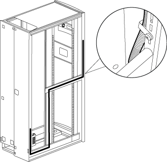

= Mova a fonte de alimentação e o cabeamento do emblema
:allow-uri-read: 
:icons: font
:imagesdir: ../media/

[role="lead"]
Você deve mover a fonte de alimentação e o cabeamento iluminado do emblema para o lado oposto da estrutura do gabinete do sistema antes de inverter a porta e reinstalar o emblema iluminado.

Você deve ter removido a porta do gabinete do sistema e os painéis laterais.

Você deve mover a fonte de alimentação, o cabo de alimentação e o canal de cabeamento iluminados para o lado oposto do gabinete do sistema quando você inverter a porta do gabinete do sistema. O conjunto é projetado de modo que o cabo do emblema esteja na lateral do gabinete onde a dobradiça da porta está instalada.

. Abra o grampo de fixação do cabo de alimentação e, em seguida, desligue o cabo de alimentação da fonte de alimentação.
. Retire o alojamento da fonte de alimentação e a fonte de alimentação, utilizando a ilustração para referência:
+
image::../media/drw_sys_cab_bezel_psu_remove_ozeki.gif[Como remover o alojamento da fonte de alimentação e a fonte de alimentação]

+
.. Levante o pino de retenção no alojamento da fonte de alimentação e, em seguida, retire a tampa do alojamento rodando-a para baixo e levantando-a do alojamento da fonte de alimentação traseira.
+

NOTE: A fonte de alimentação é conetada ao alojamento da fonte de alimentação com um remendo do do gancho e do laço.

.. Desligue a fonte de alimentação do cabo do emblema iluminado e, em seguida, coloque a tampa da fonte de alimentação e da fonte de alimentação na lateral.
.. Retire os parafusos da parte superior e inferior do alojamento da fonte de alimentação que está ligado à estrutura do gabinete do sistema e, em seguida, retire o alojamento da fonte de alimentação.

. Instale o alojamento da fonte de alimentação e da fonte de alimentação no lado oposto do armário do sistema:
+
.. Localize os dois orifícios dos parafusos ao lado um do outro na estrutura do gabinete e, em seguida, conete a parte superior do alojamento da fonte de alimentação à parte inferior mais dos dois orifícios dos parafusos.
+

NOTE: Pode ser necessário remover a correia de retenção do cabo inferior, se estiver presente.

.. Fixe a parte inferior do alojamento da fonte de alimentação à estrutura do gabinete do sistema.
.. Instale a tampa da fonte de alimentação e a fonte de alimentação alinhando os ganchos da tampa com a fonte de alimentação de volta, puxando o êmbolo para cima na tampa, girando o êmbolo para fechar e, em seguida, soltando o êmbolo.

. Retire a conduta de alimentação da moldura removendo os grampos de fixação da conduta dos grampos de fixação e, em seguida, deslize a conduta para fora do cabo de alimentação.
+
Mantenha os grampos de fixação e os parafusos para instalar a conduta no lado oposto do gabinete.

+

. Mova o cabo de alimentação do emblema para o outro lado do gabinete:
+
image::../media/drw_sys_cab_bezel_power_cable_move.gif[Como mover o cabo de alimentação do emblema para o outro lado do gabinete]

+
.. Gire o retentor do cabo de borracha na vertical do gabinete 180o para a direita, remova-o da estrutura do gabinete do sistema e, em seguida, puxe cuidadosamente o cabo para fora do gabinete do sistema.
.. Mova o cabo para o outro lado do gabinete e, em seguida, passe-o completamente pelo orifício perto da parte superior do gabinete na vertical.
.. Alinhe o retentor do cabo de borracha com o orifício na estrutura, empurre-o até onde quer que vá e, em seguida, rode o retentor do cabo 180o para a esquerda para o fixar.
.. Passe o cabo ao longo da estrutura do gabinete até a parte de trás do gabinete.

. Volte a instalar a conduta do cabo:
+
.. Deslize a conduta sobre o cabo de alimentação da PDU e encaminhe a conduta ao longo da estrutura do gabinete do sistema para a PDU.
.. Instale os grampos de fixação da conduta do outro lado do gabinete sobre a conduta para prendê-la à estrutura do gabinete.

. Conete o cabo do emblema novamente à fonte de alimentação, mas não reconete a fonte de alimentação à fonte de alimentação.

