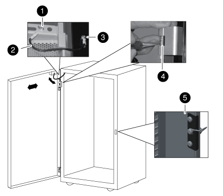

= Inverta a dobradiça da porta e o trinco da fechadura
:allow-uri-read: 
:icons: font
:imagesdir: ../media/

[role="lead"]
Ao inverter a porta do gabinete do sistema, você deve mover a dobradiça da porta do gabinete do sistema e trava para o gabinete do sistema frontal oposto na vertical.

Você precisa das seguintes ferramentas:

* Chave de fendas Phillips
* Chave Allen de 5 mm; chave Allen magnética é recomendada
* Alicate de pontas
* Escada para que você possa facilmente acessar os parafusos Allen na dobradiça superior
+
.. Retire os parafusos que fixam a dobradiça superior da estrutura do armário do sistema e coloque os parafusos e a dobradiça de lado.
+

NOTE: Tenha cuidado ao remover os parafusos Allen para evitar cair na estrutura do gabinete. Os parafusos Allen sobressalentes são fornecidos no kit de peças sobressalentes fornecido com o gabinete do sistema.

.. Retire os parafusos que fixam a dobradiça inferior da estrutura do armário do sistema e coloque os parafusos e a dobradiça de lado.
+

+
|===

 a| 
image:../media/icon_round_1.png["Legenda número 1"]

 a| 
Parafuso de aterramento da porta com pá de fio de aterramento

 a| 
image:../media/icon_round_2.png["Legenda número 2"]

 a| 
Fio de aterramento

 a| 
image:../media/icon_round_3.png["Legenda número 3"]

 a| 
Terminal de ligação à terra do fio

 a| 
image:../media/icon_round_4.png["Legenda número 4"]

 a| 
Dobradiça da porta dianteira superior com pino da dobradiça preso pelo grampo de fixação

 a| 
image:../media/icon_round_5.png["Legenda número 5"]

 a| 
Trinco de bloqueio

|===
.. Inverta o pino da dobradiça da dobradiça superior:
+
... Levante o pino da dobradiça e exponha o grampo de fixação no veio do pino da dobradiça.
... Utilizando o alicate de pontas, retire cuidadosamente o grampo de fixação do veio do pino da dobradiça e coloque-o de lado.
... Deslize o pino da dobradiça e a mola para fora do corpo da dobradiça.
... Rode a dobradiça de forma a que os orifícios da rosca fiquem virados para o lado oposto da dobradiça e, em seguida, instale o pino da dobradiça e a mola de volta na dobradiça.
... Instale o grampo de fixação da dobradiça no pino da dobradiça.
+
Certifique-se de que empurra completamente o grampo de fixação para o pino da dobradiça.

.. Volte a instalar as dobradiças:
+
... Insira o parafuso Allen superior através da vertical do armário do sistema, alinhando-o com o orifício roscado superior na dobradiça superior e, em seguida, aperte parcialmente o parafuso Allen.
+
Não aperte completamente o parafuso até que o segundo parafuso Allen seja instalado.

... Insira o parafuso Allen inferior através da vertical do armário do sistema, alinhando-o com o orifício roscado inferior na dobradiça superior e, em seguida, aperte parcialmente o parafuso Allen.
... Aperte os parafusos Allen superior e inferior.
... Repita estes passos para a dobradiça inferior.

.. Retire os parafusos do trinco de bloqueio e, em seguida, desloque o trinco de bloqueio para o armário do sistema dianteiro oposto na vertical.
.. Rode o trinco 180 graus e, em seguida, fixe-o na vertical do compartimento do sistema.

