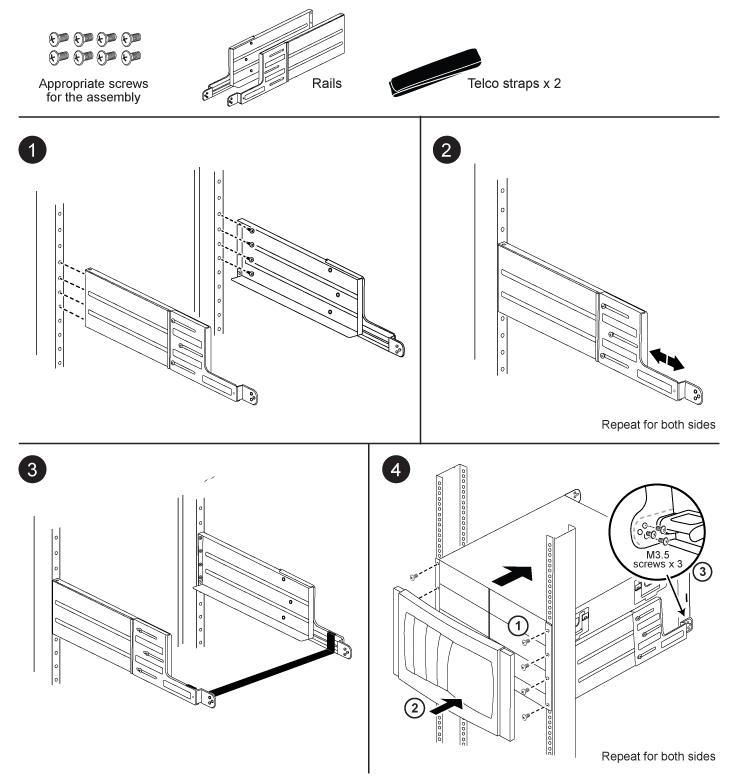

= Instruções de instalação do kit de trilho de suporte de dois pilares - AFF A700 e FAS9000
:allow-uri-read: 
:icons: font
:imagesdir: ../media/

[role="lead"]
Existem dois kits de trilho de suporte de dois postes que podem ser usados com os sistemas FAS9000 e AFF A700. Um kit permite-lhe montar o seu sistema de montagem embutida no rack de dois pilares, e o outro kit permite-lhe montar o seu sistema no rack de dois pilares.

== Instale o kit de calha de montagem intermédia de dois postes

image::../media/drw_telco_mid_mount_1.png[Como instalar o kit de calha de montagem intermédia de dois postes]

== Instale o kit de calha de montagem embutida de dois pilares

