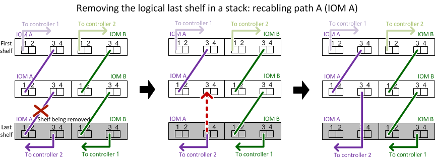

= Hot-remover uma prateleira - prateleiras com módulos IOM12/IOM12B
:allow-uri-read: 
:icons: font
:imagesdir: ../media/

[role="lead"]
Você pode remover sem interrupção um compartimento de disco com módulos IOM12/IOM12B (remover sem interrupções um compartimento de disco de um sistema ligado e e/S em andamento) quando precisar mover ou substituir um compartimento de disco. É possível remover um ou mais compartimentos de disco de qualquer lugar dentro de uma stack de gavetas de disco ou remover uma stack de gavetas de disco.

.Antes de começar
* Seu sistema precisa ser uma configuração de HA, HA de três caminhos, multipath, HA de quatro caminhos ou de quatro caminhos.
+
Para plataformas com storage interno, o storage externo precisa ser cabeado como HA multipath, HA de três caminhos ou multipath.

+

NOTE: Para um sistema de controladora única da série FAS2600 que tem o storage externo cabeado com conectividade multipath, o sistema é uma configuração de caminho misto porque o storage interno usa conectividade de caminho único.

* O sistema não pode ter mensagens de erro de cabeamento SAS.
+
Você pode baixar e executar o Active IQ Config Advisor para visualizar quaisquer mensagens de erro de cabeamento SAS e as ações corretivas que você deve tomar.

+
https://mysupport.netapp.com/site/tools["NetApp Downloads: Config Advisor"^]

* As configurações de par HA não podem estar em um estado de aquisição.
* Você precisa ter removido todos os agregados das unidades de disco (as unidades de disco devem ser sobressalentes) nos compartimentos de disco que você está removendo.
+

NOTE: Se você tentar este procedimento com agregados no compartimento de disco que você está removendo, poderá falhar o sistema com um pânico multidisco.

+
Você pode usar o `storage aggregate offline -aggregate _aggregate_name_` comando e, em seguida, o `storage aggregate delete -aggregate _aggregate_name_` comando.

* Se você estiver removendo uma ou mais gavetas de disco de dentro de uma stack, terá que ter fatorado a distância para ignorar as gavetas de disco que você está removendo. Portanto, se os cabos atuais não forem longos o suficiente, você precisará ter cabos mais longos disponíveis.

.Sobre esta tarefa
* *Prática recomendada:* a prática recomendada é remover a propriedade da unidade de disco depois de remover os agregados das unidades de disco nas prateleiras de disco que você está removendo.
+
A remoção das informações de propriedade de uma unidade de disco sobressalente permite que a unidade de disco seja adequadamente integrada em outro nó (conforme necessário).

[NOTE]
====
O procedimento para remover a propriedade de unidades de disco requer que você desative a atribuição automática de propriedade de disco. Reative a atribuição automática de propriedade de disco no final deste procedimento.

https://docs.netapp.com/us-en/ontap/disks-aggregates/index.html["Visão geral de discos e agregados"^]

====
* Para um sistema ONTAP em cluster que é maior que dois nós, a prática recomendada é reatribuir o epsilon a um par de HA diferente daquele que está sendo submetido à manutenção planejada.
+
A reatribuição do epsilon minimiza o risco de erros imprevistos que afetam todos os nós em um sistema ONTAP em cluster. Você pode usar as etapas a seguir para determinar o nó segurando o epsilon e reatribuir o epsilon, se necessário:

+
.. Defina o nível de privilégio como avançado: `set -privilege advanced`
.. Determine qual nó contém o epsilon: `cluster show`
+
O nó que contém epsilon é exibido `true` na `Epsilon` coluna. (Os nós que não possuem epsilon mostram `false`.)

.. Se o nó no par de HA que está sendo mantido em manutenção for exibido `true` (contém epsilon), remova o epsilon do nó: `cluster modify -node _node_name_ -epsilon false`
.. Atribua o epsilon a um nó em outro par de HA: `cluster modify -node _node_name_ -epsilon true`
.. Voltar ao nível de privilégio de administrador: `set -privilege admin`

* Se você estiver removendo um compartimento de disco de uma stack (mas mantendo a stack), poderá verificar um caminho de cada vez (caminho A e, depois, caminho B) para ignorar o compartimento de disco que você está removendo para manter sempre a conectividade de caminho único das controladoras para a stack.
+

NOTE: Se você não manter a conectividade de caminho único das controladoras para a stack ao reativar a stack para ignorar o compartimento de disco que você está removendo, poderá falhar o sistema com um pânico multidisco.

* *Possíveis danos na prateleira:* se você estiver removendo uma prateleira DS460C e estiver movendo-a para uma parte diferente do data center ou transportando-a para um local diferente, consulte a seção "mover ou transportar DS460C prateleiras" no final deste procedimento.

.Passos
. Verifique se a configuração do sistema é `Multi-Path HA`, `tri-path HA`, `Multi-Path`, , `Quad-path HA` ou `Quad-path` executando o `sysconfig` comando do nodeshell de qualquer controlador.
+
Pode levar até um minuto para o sistema concluir a descoberta.

+
A configuração é listada no `System Storage Configuration` campo.

+

NOTE: Para um sistema de controladora única da série FAS2600 que tem o storage externo cabeado com conectividade multipath, a saída é exibida como `mixed-path` porque o storage interno usa conectividade de caminho único.

. Verifique se as unidades de disco nos compartimentos de disco que você está removendo não têm agregados (são sobressalentes) e a propriedade foi removida:
+
.. Digite o seguinte comando a partir do clustershell de qualquer controlador: `storage disk show -shelf _shelf_number_`
.. Verifique a saída para verificar se não há agregados nas unidades de disco nas gavetas de disco que você está removendo.
+
As unidades de disco sem agregados têm um traço na `Container Name` coluna.

.. Verifique a saída para verificar se a propriedade foi removida das unidades de disco nas prateleiras de disco que você está removendo.
+
As unidades de disco sem propriedade têm um traço na `Owner` coluna.

+

NOTE: Se você tiver unidades de disco com falha na gaveta que você está removendo, elas quebraram na `Container Type` coluna. (A unidade de disco com falha não tem propriedade.)

+
A saída a seguir mostra que as unidades de disco no compartimento de disco que está sendo removido (compartimento de disco 3) estão no estado correto para remover o compartimento de disco. Os agregados são removidos em todas as unidades de disco; portanto, um traço aparece `Container Name` na coluna para cada unidade de disco. A propriedade também é removida em todas as unidades de disco; portanto, um traço aparece `Owner` na coluna para cada unidade de disco.

+
[listing]
----
cluster::> storage disk show -shelf 3

           Usable           Disk   Container   Container
Disk         Size Shelf Bay Type   Type        Name       Owner
-------- -------- ----- --- ------ ----------- ---------- ---------
...
1.3.4           -     3   4 SAS    spare                -         -
1.3.5           -     3   5 SAS    spare                -         -
1.3.6           -     3   6 SAS    broken               -         -
1.3.7           -     3   7 SAS    spare                -         -
...
----
. Localize fisicamente os compartimentos de disco que você está removendo.
+
Se necessário, você pode ligar os LEDs de localização (azul) do compartimento de disco para ajudar a localizar fisicamente o compartimento de disco afetado: `storage shelf location-led modify -shelf-name _shelf_name_ -led-status on`

+

NOTE: Um compartimento de disco tem três LEDs de localização: Um no painel de exibição do operador e um em cada módulo IOM12. Os LEDs de localização permanecem acesos durante 30 minutos. Você pode desativá-los digitando o mesmo comando, mas usando a opção Off.

. Se você estiver removendo toda uma pilha de compartimentos de disco, execute as seguintes etapas; caso contrário, vá para a próxima etapa:
+
.. Remova todos os cabos SAS no caminho A (Iom A) e no caminho B (IOM B).
+
Isso inclui cabos controlador a compartimento e cabos de prateleira a prateleira para todas as gavetas de disco na stack que você está removendo.

.. Avance para o passo 9.

. Se você estiver removendo uma ou mais compartimentos de disco de uma stack (mas mantendo a stack), reabilite as conexões de stack de caminho A (Iom A) para ignorar as gavetas de disco que você está removendo preenchendo o conjunto de subetapas aplicável:
+
Se você estiver removendo mais de um compartimento de disco na pilha, conclua o conjunto aplicável de subetapas de um compartimento de disco de cada vez.

+

NOTE: Aguarde pelo menos 10 segundos antes de ligar a porta. Os conetores de cabo SAS são chaveados; quando orientados corretamente para uma porta SAS, o conetor se encaixa no lugar e o LED LNK da porta SAS do compartimento de disco fica verde. Para compartimentos de disco, você insere um conetor de cabo SAS com a aba de puxar orientada para baixo (na parte inferior do conetor).

+
[cols="2*"]
|===
| Se você está removendo... | Então... 

 a| 
Um compartimento de disco de uma extremidade (primeira lógica ou última gaveta de disco) de uma pilha
 a| 
.. Remova qualquer cabeamento de gaveta a prateleira das portas IOM A na gaveta de disco que você está removendo e coloque-as de lado.
.. Desconete qualquer cabeamento de controladora a stack conectado a portas IOM A no compartimento de disco que você está removendo e conete-os às mesmas portas IOM A na próxima gaveta de disco na stack.
+
O compartimento de disco "próximo" pode estar acima ou abaixo do compartimento de disco que você está removendo, dependendo de qual extremidade da pilha você está removendo o compartimento de disco.

 a| 
Um compartimento de disco do meio da Stack Um compartimento de disco no meio de uma stack só é conectado a outras gavetas de disco - não a controladoras.
 a| 
.. Remova qualquer cabeamento de gaveta a prateleira das portas Iom A 1 e 2 ou das portas 3 e 4 na gaveta de disco que você está removendo e IOM A da próxima gaveta de disco e, em seguida, coloque-os de lado.
.. Desconete o cabeamento restante de gaveta a prateleira conetado a portas IOM A no compartimento de disco que você está removendo e conete-os às mesmas portas IOM A na próxima gaveta de disco na stack. O compartimento de disco "'próximo" pode estar acima ou abaixo do compartimento de disco que você está removendo, dependendo de quais portas IOM A (1 e 2 ou 3 e 4) você removeu o cabeamento.

|===
+
Você pode consultar os exemplos de cabeamento a seguir ao remover um compartimento de disco de uma extremidade de uma stack ou do meio de uma stack. Observe o seguinte sobre os exemplos de cabeamento:

+
** Os módulos IOM12/IOM12B estão dispostos lado a lado como em um compartimento de disco DS224C ou DS212C; se você tiver um DS460C, os módulos IOM12/IOM12B são dispostos um acima do outro.
** A stack em cada exemplo é cabeada por cabeamento padrão de gaveta a prateleira, que é usado em stacks cabeadas com HA multipath, HA de três caminhos ou conectividade multipath.
+
Você pode inferir a reativação se a pilha for cabeada com conetividade HA de quatro vias ou quatro vias, que usa cabeamento de duas grandes prateleiras para prateleiras.

** Os exemplos de cabeamento demonstram a reativação de um dos caminhos: Caminho A (Iom A).
+
Repita a reativação para o caminho B (IOM B).

** O exemplo de cabeamento para a remoção de um compartimento de disco do final de uma stack demonstra a remoção do último compartimento de disco lógico em uma stack cabeada por conectividade de HA multipath ou de HA de três caminhos.
+
Você pode inferir a desativação se estiver removendo o primeiro compartimento de disco lógico em uma stack ou se sua stack tiver conectividade multipath.

+

+
image::../media/drw_hotremove_middle.gif[Hot remova uma prateleira do meio de uma pilha]

. Verifique se você ignorou as gavetas de disco que está removendo e restabeleceu corretamente as conexões de pilha de caminho A (Iom A): `storage disk show -port`
+
Para configurações de par de HA, você executa esse comando a partir do clustershell de qualquer controlador. Pode levar até um minuto para o sistema concluir a descoberta.

+
As duas primeiras linhas de saída mostram unidades de disco com conetividade através do caminho A e caminho B. as duas últimas linhas de saída mostram unidades de disco com conetividade através de um único caminho, caminho B.

+
[listing]
----
cluster::> storage show disk -port

PRIMARY  PORT SECONDARY      PORT TYPE SHELF BAY
-------- ---- ---------      ---- ---- ----- ---
1.20.0   A    node1:6a.20.0  B    SAS  20    0
1.20.1   A    node1:6a.20.1  B    SAS  20    1
1.21.0   B    -              -    SAS  21    0
1.21.1   B    -              -    SAS  21    1
...
----
. O próximo passo depende da `storage disk show -port` saída do comando:
+
[cols="2*"]
|===
| Se a saída mostrar... | Então... 

 a| 
Todas as unidades de disco na pilha são conetadas pelo caminho A e caminho B, exceto as que estão nos compartimentos de disco que você desconetou, que só são conetadas pelo caminho B
 a| 
Vá para a próxima etapa.

Você ignorou com sucesso os compartimentos de disco que está removendo e restabeleceu o caminho A nas unidades de disco restantes na pilha.

 a| 
Qualquer coisa além do acima
 a| 
Repita os passos 5 e 6.

Você deve corrigir o cabeamento.

|===
. Conclua as seguintes subetapas para os compartimentos de disco (na pilha) que você está removendo:
+
.. Repita os passos 5 a 7 para o caminho B..
+

NOTE: Ao repetir a Etapa 7 e se tiver reconfigurado a pilha corretamente, você só verá todas as unidades de disco restantes conetadas através do caminho A e do caminho B.

.. Repita a etapa 1 para confirmar se a configuração do sistema é a mesma que antes de remover um ou mais compartimentos de disco de uma pilha.
.. Vá para a próxima etapa.

. Se quando você removeu a propriedade das unidades de disco (como parte da preparação para este procedimento), você desativou a atribuição automática de propriedade de disco, reative-a inserindo o seguinte comando; caso contrário, vá para a próxima etapa: `storage disk option modify -autoassign on`
+
Para configurações de par de HA, você executa o comando a partir do clustershell de ambos os controladores.

. Desligue os compartimentos de disco que você desconetou e desconete os cabos de energia das gavetas de disco.
. Remova as prateleiras de disco do rack ou gabinete.
+
Para tornar um compartimento de disco mais leve e fácil de manobrar, remova as fontes de alimentação e os módulos de e/S (IOMs).

+
Para DS460C prateleiras de disco, uma prateleira totalmente carregada pode pesar aproximadamente 247 lbs (112 kg); portanto, tenha o seguinte cuidado ao remover uma prateleira de um rack ou gabinete.

+

CAUTION: Recomenda-se que utilize um elevador mecanizado ou quatro pessoas utilizando as pegas de elevação para mover com segurança uma prateleira de DS460C mm.

+
A sua remessa DS460C foi embalada com quatro alças de elevação destacáveis (duas para cada lado). Para utilizar as pegas de elevação, instale-as inserindo as patilhas das pegas nas ranhuras laterais da prateleira e empurrando-as para cima até encaixarem no lugar. Em seguida, ao deslizar a prateleira do disco para os trilhos, você descola um conjunto de alças de cada vez usando o trinco do polegar. A ilustração a seguir mostra como conetar uma alça de elevação.

+
image::../media/drw_ds460c_handles.gif[Instalar as pegas de elevação]

+
Se você estiver movendo a prateleira DS460C para uma parte diferente do data center ou transportando-a para um local diferente, consulte a seção "mover ou transportar DS460C prateleiras".

.Mova ou transporte DS460C prateleiras
Se você mover uma gaveta de DS460C TB para uma parte diferente do data center ou transportar a gaveta para um local diferente, precisará remover as unidades das gavetas da unidade para evitar possíveis danos às gavetas e unidades da unidade.

* Se, ao instalar DS460C gavetas como parte da nova instalação do sistema ou do hot-add de gaveta, você salvou os materiais de embalagem da unidade, use-os para reempacotar as unidades antes de movê-las.
+
Se você não salvou os materiais de embalagem, você deve colocar drives em superfícies almofadadas ou usar embalagens almofadadas alternativas. Nunca empilhar unidades umas sobre as outras.

* Antes de manusear as unidades, use uma pulseira antiestática aterrada em uma superfície não pintada no chassi do gabinete de armazenamento.
+
Se uma correia de pulso não estiver disponível, toque numa superfície não pintada no chassis do compartimento de armazenamento antes de manusear uma unidade.

* Você deve tomar medidas para lidar com as unidades com cuidado:
+
** Utilize sempre duas mãos ao remover, instalar ou transportar uma unidade para suportar o seu peso.
+

CAUTION: Não coloque as mãos sobre as placas de acionamento expostas na parte inferior do suporte da transmissão.

** Tenha cuidado para não bater as transmissões contra outras superfícies.
** As unidades devem ser mantidas longe de dispositivos magnéticos.
+

CAUTION: Os campos magnéticos podem destruir todos os dados em uma unidade e causar danos irreparáveis ao circuito da unidade.

