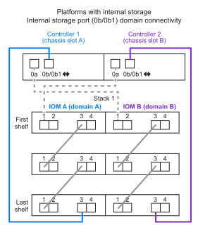

= Regras e conceitos de cabeamento SAS - compartimentos com módulos IOM12/IOM12B
:allow-uri-read: 
:icons: font
:imagesdir: ../media/

[role="lead"]
Os compartimentos de disco com módulos IOM12/IOM12B podem ser cabeados em configurações de par de HA e controlador único (para plataformas compatíveis) aplicando as regras de cabeamento SAS: Regras de configuração, regras de numeração de slots de controladora, regras de conexão de gaveta a gaveta, regras de conexão de controladora a pilha e, se aplicável, regras de cabos óticos SAS HD mini-SAS.

NOTE: As regras de cabeamento SAS relativas às regras de numeração de slots da controladora, regras de conexão de prateleira a prateleira e regras de conexão de controladora a pilha descritas neste guia são as mesmas regras que se aplicam a todas as gavetas de disco SAS, quer tenham módulos de IOM12/IOM12B, IOM6 ou IOM3. No entanto, as informações deste guia são específicas para as caraterísticas exclusivas das prateleiras de disco com módulos IOM12/IOM12B e seu uso em configurações compatíveis.

As regras de cabeamento SAS relativas às regras de configuração e às regras de cabo ótico SAS HD mini-SAS descritas neste guia são específicas para as prateleiras de disco com módulos IOM12/IOM12B.

As regras de cabeamento SAS descritas neste guia equilibram o cabeamento SAS entre as portas SAS integradas e as portas SAS do adaptador de barramento do host para fornecer configurações de controladora de storage altamente disponíveis e atender aos seguintes objetivos:

* Fornecer um algoritmo universal único e facilmente compreendido para todos os produtos e configurações SAS
* Produza o mesmo cabeamento físico ao gerar a Lista de materiais (bom), seguida na fábrica e no campo
* São verificáveis por software e ferramentas de verificação de configuração
* Fornecer o máximo de resiliência possível para manter a disponibilidade e minimizar a dependência de aquisições de controladores

Você deve evitar desviar-se das regras; desvios podem reduzir a confiabilidade, universalidade e comunalidade.

== Regras de configuração

Os compartimentos de disco com módulos IOM12/IOM12B são compatíveis com tipos específicos de par de HA e configurações de controlador único.

NOTE: As plataformas FAS25XX não são abordadas neste conteúdo.

[NOTE]
====
Para obter informações atuais sobre configurações de cabeamento compatíveis para o modelo da sua plataforma, consulte o Hardware Universe.

https://hwu.netapp.com["NetApp Hardware Universe"^]

====
* As configurações de par HA devem ser cabeadas como configurações de HA multipath ou HA de caminho quádruplo com as seguintes exceções:
+
** As plataformas com armazenamento interno não suportam conetividade HA de quatro vias.
** Um par de HA de FAS2800 TB pode ser cabeado como HA de três caminhos.
+
Informações sobre a conetividade FAS2800 podem ser encontradas na <<Conetividade HA de três vias>>seção.

** As plataformas com storage interno podem ser cabeadas como configurações de HA de caminho único (da porta 0b/0B1 para compartimentos externos) para dar suporte à conectividade a um dispositivo externo de backup em fita SAS (da porta 0a).

[NOTE]
====
Para FAS2800 pares de HA, embora o cabeamento para compartimentos externos seja HA de caminho único, devido à conexão interna de cada controladora da porta 0b ao seu expansor local (IOM12G) e à porta 0C ao expansor de seu parceiro, a configuração de par de HA é HA de multipath.

====
* As configurações de controlador único devem ser cabeadas como configurações multipath ou de caminho quádruplo, com as seguintes exceções:
+
** As configurações de controlador único da série FAS2600 podem ser cabeadas como configurações de caminho único.
+
Como o armazenamento interno usa conetividade de caminho único, o ONTAP emite avisos ocasionais de que caminhos mistos são detetados. Para evitar esses avisos, você pode usar a conectividade de caminho único para os compartimentos de disco externos. Além disso, você pode usar conetividade de caminho único quando um dispositivo de backup de fita SAS externo é usado.

** As configurações de controlador único da série FAS2600 não suportam conetividade quad-path.

== Regras de numeração de slots do controlador

Com o objetivo de aplicar regras de cabeamento em todos os pares de HA compatíveis e configurações de controladora única, é usada uma convenção de numeração de slot de controladora.

* Para todos os pares de HA e configurações de controlador único, aplica-se o seguinte:
+
** Um HBA SAS em um slot PCI físico é definido como ocupando o slot PCI 1, 2, 3 e assim por diante, independentemente da etiqueta física do slot em um controlador.
+
Por exemplo, se os HBAs SAS ocuparem os slots PCI físicos 3, 5 e 7, eles seriam designados como slots 1, 2 e 3 com a finalidade de aplicar as regras de cabeamento SAS.

** Um HBA SAS integrado é definido como ocupando o slot PCI 0 assim como é rotulado em um controlador.
** Cada porta em cada slot é definida exatamente como é rotulada em um controlador. Por exemplo, o slot 0 com duas portas é referido como 0a e 0b. O slot 1 com quatro portas é referido como 1a, 1b, 1c e 1D.
+
Neste documento, os slots e as portas de slot são representados da seguinte forma:

+
image::../media/slot0_rules.png[slot e slot [convénios de porta]

== Regras de conexão de prateleira para prateleira

Quando você tem mais de um compartimento de disco em uma stack de gavetas de disco, eles se conectam entre si por meio de cada domínio SAS (Iom A e IOM B) usando o cabeamento de gaveta a prateleira "padrão" ou "amplo" aplicável. O uso do cabeamento "andard" ou "duble-wide" depende da configuração que você tem.

=== Conectividade padrão de compartimento para compartimento

* A conectividade padrão de compartimento para compartimento é usada em qualquer stack de gavetas de disco com mais de um compartimento de disco.
+
Uma conexão de cabo é necessária entre as gavetas de disco em cada domínio - domínio A (Iom A) e domínio B (IOM B).

* A prática recomendada é usar as portas IOM 3 e 1 para conectividade padrão de gaveta a prateleira.
+
Da primeira gaveta lógica à última gaveta lógica em uma stack, você conecta a porta IOM 3 à porta IOM 1 da próxima gaveta no domínio A e, em seguida, o domínio B.

image::../media/drw_shelf_to_shelf_standard.gif[conectividade de gaveta padrão a gaveta]

=== Conectividade de gaveta a prateleira dupla

* A conetividade de prateleira a prateleira de largura dupla é usada em configurações de caminho quádruplo (caminho quádruplo HA e caminho quádruplo).
* A conectividade de gaveta a gaveta de largura dupla requer duas conexões de cabo entre as gavetas de disco em cada domínio - domínio A (Iom A) e domínio B (IOM B).
+
A primeira conexão a cabo é cabeada como conectividade de gaveta a prateleira padrão (usando as portas IOM 3 e 1). A segunda conexão a cabo é cabeada como conectividade de gaveta a gaveta dupla de largura (usando as portas IOM 4 e 2).

+
Da primeira gaveta lógica à última gaveta lógica em uma stack, você conecta a porta IOM 3 à porta IOM 1 da próxima gaveta no domínio A e, em seguida, o domínio B. da primeira gaveta lógica à última gaveta lógica em uma stack, conecta a porta IOM 4 à porta IOM 2 da próxima gaveta no domínio A e, em seguida, o domínio B. (as portas IOM cabeadas como conectividade de largura dupla são mostradas com azul).

image::../media/drw_shelf_to_shelf_double_wide.gif[conectividade de gaveta dupla e ampla para gaveta]

== Regras de conexão controlador para pilha

Você pode fazer o cabeamento correto das conexões SAS de cada controladora para cada stack em um par de HA ou em uma configuração de controladora única, entendendo que os compartimentos de disco SAS usam a propriedade de disco baseada em software, como as portas A/C e B/D do controlador são conetadas a stacks, como as portas A/C e B/D do controlador são organizadas em pares de portas e como as plataformas com storage interno têm suas portas conectadas às stacks.

=== Regra de propriedade de disco baseada em software do compartimento de disco SAS

Os compartimentos de disco SAS usam a propriedade de disco baseada em software (não a propriedade de disco baseada em hardware). Isso significa que a propriedade da unidade de disco é armazenada na unidade de disco em vez de ser determinada pela topologia das conexões físicas do sistema de armazenamento (como é para a propriedade de disco baseado em hardware). Especificamente, a propriedade da unidade de disco é atribuída pelo ONTAP (automaticamente ou por comandos CLI), não por como você faz o cabeamento das conexões controladora para pilha.

Os compartimentos de disco SAS nunca devem ser cabeados usando o esquema de propriedade de disco baseado em hardware.

=== Regras de conexão de portas A e C do controlador (para plataformas sem armazenamento interno)

* As portas a e C são sempre os caminhos principais para uma pilha.
* As portas a e C sempre se conetam ao primeiro compartimento de disco lógico em uma pilha.
* As portas a e C sempre se conectam à gaveta de disco portas IOM 1 e 2.
+
A porta IOM 2 é usada somente para configurações de HA e quad-path.

* As portas A e C da controladora 1 sempre se conetam ao IOM A (domínio A).
* As portas A e C da controladora 2 sempre se conetam ao IOM B (domínio B).

A ilustração a seguir destaca como as portas A e C do controlador se conetam em uma configuração de HA multipath com um HBA de quatro portas e duas pilhas de compartimentos de disco. As conexões à pilha 1 são mostradas em azul. As conexões à pilha 2 são mostradas em laranja.

image::../media/drw_controller_to_stack_rules_ports_a_and_c_example.gif[Regras de conexão de portas A e C do controlador para plataformas sem armazenamento interno]

=== Regras de conexão de portas B e D do controlador (para plataformas sem armazenamento interno)

* As portas B e D são sempre os caminhos secundários para uma pilha.
* As portas B e D sempre se conetam ao último compartimento de disco lógico em uma pilha.
* As portas B e D sempre se conetam às portas IOM 3 e 4 da gaveta de disco.
+
A porta IOM 4 é usada somente para configurações de HA e quad-path.

* As portas B e D da controladora 1 sempre se conetam ao IOM B (domínio B).
* As portas B e D da controladora 2 sempre se conetam ao IOM A (domínio A).
* As portas B e D são conetadas às pilhas, compensando a ordem dos slots PCI por uma, de modo que a primeira porta no primeiro slot seja cabeada por último.

A ilustração a seguir destaca como as portas B e D do controlador se conetam em uma configuração de HA multipath com um HBA de quatro portas e duas pilhas de compartimentos de disco. As conexões à pilha 1 são mostradas em azul. As conexões à pilha 2 são mostradas em laranja.

image::../media/drw_controller_to_stack_rules_ports_b_and_d_example.gif[Regras de conexão de portas B e D do controlador para plataformas sem armazenamento interno]

=== Regras de conexão de par de portas (para plataformas sem armazenamento interno)

As portas SAS A, B, C e D da controladora são organizadas em pares de portas usando um método que aproveita todas as portas SAS para resiliência e consistência do sistema ao fazer cabeamento de conexões de controladora a stack em configurações de par de HA e controladora única.

* Os pares de portas consistem em uma porta SAS do controlador A ou C e uma porta SAS do controlador B ou D.
+
As portas SAS a e C se conetam à primeira gaveta lógica de uma stack. As portas SAS B e D se conetam ao último compartimento lógico de uma pilha.

* Os pares de portas usam todas as portas SAS em cada controlador do sistema.
+
Você aumenta a resiliência do sistema incorporando todas as portas SAS (em um HBA em um slot PCI físico [slot 1-N] e a bordo do controlador [slot 0]) em pares de portas. Não exclua nenhuma porta SAS.

* Os pares de portas são identificados e organizados da seguinte forma:
+
.. Liste as portas A e, em seguida, as portas C na sequência de slots (0,1, 2, 3 e assim por diante).
+
Por exemplo: 1A, 2a, 3a, 1c, 2c, 3c

.. Liste as portas B e, em seguida, as portas D em sequência de slots (0,1, 2, 3 e assim por diante).
+
Por exemplo: 1B, 2b, 3b, 1D, 2D, 3D

.. Reescreva a lista de portas D e B para que a primeira porta da lista seja movida para o final da lista.
+
Por exemplo: image:../media/drw_gen_sas_cable_step2.png["Reescreva a lista de portas D e B."]

+
Compensar a ordem dos slots por um equilibra pares de portas em vários slots (slots PCI físicos e slots integrados) quando mais de um slot de portas SAS está disponível; portanto, impedindo que uma pilha seja cabeada para um único HBA SAS.

.. Emparelhe as portas A e C (listadas na etapa 1) às portas D e B (listadas na etapa 2) na ordem em que elas estão listadas.
+
Por exemplo: 1A/2b, 2a/3b, 3a/1D, 1c/2D, 2c/3D, 3c/1b.

+

NOTE: Para um par de HA, a lista de pares de portas que você identifica para o primeiro controlador também se aplica ao segundo controlador.

* Ao fazer o cabeamento do sistema, você pode usar pares de portas na ordem em que os identificou ou pode ignorar pares de portas:
+
** Use pares de portas na ordem em que você os identificou (listados) quando todos os pares de portas forem necessários para fazer o cabeamento das pilhas em seu sistema.
+
Por exemplo, se você identificou seis pares de portas para o seu sistema e tiver seis stacks para fazer o cabeamento como multipath, você caberá os pares de portas na ordem em que os listou:

+
1a/2b, 2a/3b, 3a/1d, 1c/2d, 2c/3d, 3c/1b

** Ignorar pares de portas (use cada outro par de portas) quando nem todos os pares de portas forem necessários para fazer o cabeamento das pilhas no sistema.
+
Por exemplo, se você identificou seis pares de portas para o seu sistema e tiver três stacks para cabo como multipath, você caberá a cada outro par de portas na sua lista:

+
image::../media/drw_portpair_connection_rules_list_skip.gif[Opção para ignorar pares de portas]

+

NOTE: Quando você tem mais pares de portas do que precisa para fazer o cabeamento das pilhas no sistema, a prática recomendada é ignorar pares de portas para otimizar as portas SAS no sistema. Ao otimizar as portas SAS, você otimiza o desempenho do seu sistema.

As planilhas de cabeamento de controladora a stack são ferramentas convenientes para identificar e organizar pares de portas, para que você possa fazer o cabeamento das conexões controladora a stack para o seu par de HA ou configuração de controladora única.

link:install-cabling-worksheet-template-multipath.html["Modelo de Planilha de cabeamento de controladora para stack para conectividade multipathed"]

link:install-cabling-worksheet-template-quadpath.html["Modelo de folha de trabalho de cabeamento de controladora para pilha para conetividade quad-pathed"]

=== Regras de conexão de portas 0b/0B1 e 0a para plataformas com armazenamento interno

As plataformas com armazenamento interno têm um conjunto exclusivo de regras de conexão porque cada controlador deve manter a mesma conetividade de domínio entre o armazenamento interno (porta 0b/0B1) e a pilha. Isso significa que, quando uma controladora está localizada no slot A do chassi (controladora 1), ela está no domínio A (Iom A) e, portanto, a porta 0b/0B1 deve se conetar ao Iom A na stack. Quando uma controladora está localizada no slot B do chassi (controladora 2), ela está no domínio B (IOM B) e, portanto, a porta 0b/0B1 deve se conetar ao IOM B na stack.

NOTE: As plataformas FAS25XX não são abordadas neste conteúdo.

NOTE: Se você não conetar a porta 0b/0B1 ao domínio correto (domínios de conexão cruzada), exporá seu sistema a problemas de resiliência que impedem que você execute procedimentos sem interrupções com segurança.

* Porta do controlador 0b/0B1 (porta de armazenamento interno):
+
** A porta do controlador 1 0b/0B1 sempre se coneta à IOM A (domínio A).
** A porta do controlador 2 0b/0B1 sempre se coneta à IOM B (domínio B).
** A porta 0b/0B1 é sempre o caminho principal.
** A porta 0b/0B1 sempre se coneta ao último compartimento de disco lógico em uma pilha.
** A porta 0b/0B1 sempre se coneta à porta IOM da gaveta de disco 3.

* Porta do controlador 0a (porta HBA interna):
+
** A porta do controlador 1 0a sempre se coneta ao IOM B (domínio B).
** A porta do controlador 2 0a sempre se coneta à IOM A (domínio A).
** A porta 0a é sempre o caminho secundário.
** A porta 0a sempre se coneta ao primeiro compartimento de disco lógico em uma pilha.
** A porta 0a sempre se coneta à gaveta de disco IOM porta 1.

A ilustração a seguir destaca a conectividade de domínio da porta de armazenamento interno (0b/0B1) a uma pilha externa de gavetas:

=== Conetividade HA de três vias

A conectividade HA Tri-path está disponível em FAS2800 pares de HA. A conectividade de HA com três caminhos, de cada controladora, para compartimentos internos (IOM12GU) e externos:

* A conexão interna de cada controladora, da porta 0b ao seu IOM12G local, e a porta 0C ao IOM12G de seu parceiro, fornecem conectividade de HA de par de HA multipath.
* O cabeamento das portas de storage externo de cada controladora, 0a e 0B1, oferece conectividade de HA de par de HA em três caminhos.
+
As portas 0a e 0B1 são cabeadas nas duas controladoras quando não há gavetas externas ou elas são cabeadas para gavetas externas para conseguir conectividade de HA com três caminhos.

A seguir mostra as conexões internas e o cabeamento externo da controladora que alcança conectividade HA de três caminhos:

image::../media/drw_fas2800_concept_tpha_IEOPS-950.svg[Conetividade Tri path HA]

As FAS2800 portas SAS externas:

* A porta 0a é do HBA interno (como outras plataformas com uma prateleira interna).
* A porta 0B1 é da gaveta interna (como as portas 0b em outras plataformas com uma gaveta interna).
* A porta 0B2 não é utilizada. Está desativado. Se um cabo estiver conetado a ele, uma mensagem de erro será gerada.

image::../media/drw_sas3_ports_on_fas2800_IEOPS-946.svg[FAS2800 portas sas externas]

Exemplos de cabeamento de par de HA FAS2800 podem ser encontrados link:install-cabling-worksheets-examples-fas2600.html["Exemplos de cabeamento e planilhas de cabeamento de controladora a stack para plataformas com storage interno"]na seção.

== Regras de cabo ótico mini-SAS HD SAS

Você pode usar cabos óticos mini-SAS HD SAS - cabos de cabo ótico ativo multimodo (AOC) com conetores HD mini-SAS HD para mini-SAS e cabos multimodos (OM4) com conetores HD para LC mini-SAS - para alcançar conetividade SAS de longa distância para certas configurações que têm prateleiras de disco com módulos IOM12.

* Sua plataforma e versão do ONTAP devem suportar o uso de cabos óticos SAS HD mini-SAS: Cabos de cabo ótico ativo multimodo (AOC) com conetores HD HD para mini-SAS mini-SAS e cabos multicondutor (OM4) com conetores HD para LC mini-SAS.
+
https://hwu.netapp.com["NetApp Hardware Universe"]

* Os cabos AOC multimodo ótico SAS com conetores HD mini-SAS HD-a-mini-SAS podem ser usados para conexões controlador-a-pilha e prateleira-a-prateleira, e estão disponíveis em comprimentos de até 50 metros.
* Se você estiver usando cabos multimodais óticos SAS (OM4) com conetores mini-SAS HD-para-LC (para painéis de patch), as seguintes regras se aplicam:
+
** Você pode usar esses cabos para conexões de controladora a stack e prateleira a compartimento.
+
Se você usar cabos multimodais para conexões de prateleira a prateleira, só poderá usá-los uma vez dentro de uma pilha de gavetas de disco. Você deve usar cabos AOC multimodo para conetar as conexões restantes de prateleira a prateleira.

+
Para configurações de caminho quádruplo HA e quad-path, se você usar cabos multimodais para conexões de largura dupla entre duas prateleiras de disco, a prática recomendada é usar cabos multidimensionados idênticos.

** Você deve conetar todos os oito (quatro pares) dos conetores multiconexões LC ao patch panel.
** Você precisa fornecer os patch panels e cabos inter-painel.
+
Os cabos entre painéis devem ser o mesmo modo que o cabo multicondutor: OM4 multimodo.

** Até um par de patch panels podem ser usados em um caminho.
** O caminho ponto-a-ponto (mini-SAS HD-a-mini-SAS HD) de qualquer cabo multimodo não pode exceder 100 metros.
+
O caminho inclui o conjunto de cabos breakout, patch panels e cabos entre painéis.

** O caminho total de ponta a ponta (soma de caminhos ponto a ponto do controlador para o último compartimento) não pode exceder 300 metros.
+
O caminho total inclui o conjunto de cabos de arranque, painéis de correção e cabos entre painéis.

* Os cabos SAS podem ser de cobre SAS, ótica SAS ou uma combinação.
+
Se você estiver usando uma combinação de cabos de cobre SAS e cabos óticos SAS, as seguintes regras se aplicam:

+
** As conexões de gaveta a prateleira em uma stack precisam ser todos os cabos de cobre SAS ou todos os cabos óticos SAS.
** Se as conexões de prateleira a prateleira forem cabos óticos SAS, as conexões de controladora a stack também deverão ser cabos óticos SAS.
** Se as conexões de gaveta a gaveta forem cabos de cobre SAS, as conexões de controladora a stack com essa stack poderão ser cabos óticos SAS ou cabos de cobre SAS.

