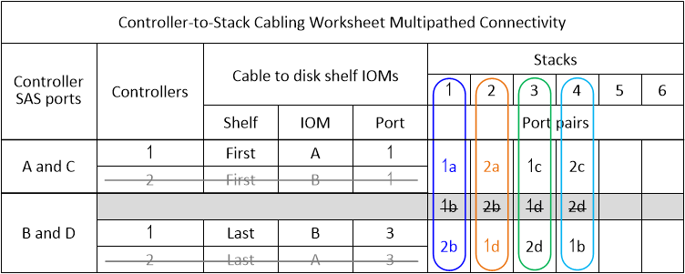

= Modelo de Planilha de cabeamento de controladora a stack para conectividade multipathed - compartimentos com módulos IOM12/IOM12B
:allow-uri-read: 
:icons: font
:imagesdir: ../media/

[role="lead"]
Ao concluir o modelo de Planilha, você pode definir os pares de portas SAS do controlador que você pode usar para vincular controladores a pilhas de compartimentos de disco com módulos IOM12/IOM12B para obter conectividade multipathed em um par de HA ou configuração de controladora única. Você também pode usar a Planilha completa para percorrer o cabeamento das conexões multipathed para sua configuração.

.Antes de começar
Se você tiver uma plataforma com armazenamento interno, use a seguinte Planilha:

link:install-cabling-worksheets-examples-fas2600.html["Exemplos de cabeamento e planilhas de cabeamento de controladora a stack para plataformas com storage interno"]

.Sobre esta tarefa
* Esse modelo de procedimento e Planilha é aplicável ao cabeamento de conectividade multipathed para uma configuração multipath ou de HA com uma ou mais stacks.
+
Exemplos de planilhas concluídas são fornecidos para configurações multipath de HA e multipath.

+
Uma configuração com dois HBAs SAS de quatro portas e duas pilhas de compartimentos de disco com módulos IOM12/IOM12B é usada para os exemplos de Planilha.

* O modelo de Planilha permite até seis pilhas; você precisa adicionar mais colunas, se necessário.
* Se necessário, consulte o link:install-cabling-rules.html["Regras e conceitos de cabeamento de SAS"] para obter informações sobre as configurações compatíveis, a convenção de numeração de slots do controlador, a conectividade de prateleira a prateleira e a conectividade de controlador para compartimento (incluindo o uso de pares de portas).
* Se necessário, depois de concluir a folha de trabalho, pode consultar link:install-cabling-worksheets-how-to-read-multipath.html["Como ler uma Planilha para conexões de cabo controlador para pilha para conetividade multipathed"]

image::../media/drw_worksheet_mpha_template.gif[Controlador MPHA para empilhar o modelo de folha de cálculo de cabeamento]

.Passos
. Nas caixas acima das caixas cinza, liste todas as portas SAS A no sistema e, em seguida, todas as portas SAS C no sistema em sequência de slots (0, 1, 2, 3, etc.).
+
Por exemplo: 1A, 2a, 1c, 2c

. Nas caixas cinza, liste todas as portas SAS B no sistema e, em seguida, todas as portas SAS D no sistema em sequência de slots (0, 1, 2, 3 e assim por diante).
+
Por exemplo: 1B, 2b, 1D, 2D

. Nas caixas abaixo das caixas cinza, reescreva a lista de portas D e B para que a primeira porta da lista seja movida para o final da lista.
+
Por exemplo: 2B, 1D, 2D, 1b

. Círculo (designar) um par de portas para cada pilha.
+
Quando todos os pares de portas estiverem sendo usados para fazer o cabeamento das pilhas no sistema, circule os pares de portas na ordem em que são definidos (listados) na Planilha.

+
Por exemplo, em uma configuração de HA de multipath com oito portas SAS e quatro stacks, o par de portas 1a 2c/2b 1b é cabeado para a stack 1 4, o par de portas 2a/1D é cabeado para a stack stack3, o par de portas 1c/2D é cabeado para a stack 2.

+
image::../media/drw_worksheet_mpha_slots_1_and_2_two_4porthbas_two_stacks.gif[Folha de cálculo do cabeamento de HA multipath preenchida]

+
Quando nem todos os pares de portas são necessários para fazer o cabeamento das pilhas no sistema, ignore os pares de portas (use cada outro par de portas).

+
Por exemplo, em uma configuração de HA multipath com oito portas SAS e duas stacks, o par de portas 1a/2b é cabeado para a stack 1 e o par de portas 1c/2D é cabeado para a stack 2. Se duas pilhas adicionais forem adicionadas posteriormente, o par de portas 2a/1D será cabeado para a pilha 3 e o par de portas 2c/1b será cabeado para a pilha 4.

+

NOTE: Quando você tem mais pares de portas do que precisa para fazer o cabeamento das pilhas no sistema, a prática recomendada é ignorar pares de portas para otimizar as portas SAS no sistema. Ao otimizar as portas SAS, você otimiza o desempenho do seu sistema.

+
image::../media/drw_worksheet_mpha_skipped_template.gif[Planilha de cabeamento de HA multipath mostrando pares de portas ignorados]

+
Você pode usar a Planilha concluída para fazer o cabeamento do sistema.

. Se você tiver uma configuração de controladora única (multipath), cruze as informações da controladora 2.
+

+
Você pode usar a Planilha concluída para fazer o cabeamento do sistema.

