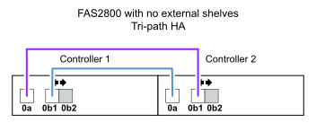

= Planilhas de cabeamento para as prateleiras DS212C, DS224C ou DS460C com storage interno
:allow-uri-read: 
:icons: font
:imagesdir: ../media/

[role="lead"]
Você pode usar as planilhas de cabeamento do controlador para o stack e os exemplos de cabeamento preenchidos para conectar plataformas com storage interno. Isso se aplica a shelves com módulos IOM12, IOM12B ou IOM12C.

* Se necessário, consulte a link:install-cabling-rules.html["Regras e conceitos de cabeamento de SAS"] para obter informações sobre configurações compatíveis, conectividade de gaveta a prateleira e conectividade de controlador para compartimento.
* Exemplos de cabeamento mostram os cabos de controlador para stack como sólidos ou tracejados para distinguir as conexões de porta 0b/0B1 do controlador 0a.
+
image::../media/drw_fas2600_controller_to_stack_cable_type_key_IEOPS-947.svg[Chave tipo cabo para plataformas com armazenamento integrado]

* Os exemplos de cabeamento mostram conexões de controlador para stack e de prateleira para prateleira em duas cores diferentes para distinguir a conectividade por meio de IOM A (domínio A) e IOM B (domínio B).
+
image::../media/drw_fas2600_cable_color_key.png[Chave de cor de cabo para plataformas com armazenamento integrado]

== Plataforma FAS2820 em uma configuração de HA multipath sem gavetas externas

O exemplo a seguir mostra que nenhum cabeamento é necessário para acessar a conectividade de HA multipath:

image::../media/drw_fas2800_noshelf_mpha_IEOPS-954.svg[FAS2820 ha multipath sem gavetas externas]

== Plataforma FAS2820 em uma configuração de HA de três caminhos sem gavetas externas

O exemplo de cabeamento a seguir mostra o cabeamento necessário entre as duas controladoras para obter conectividade tri-path:

== Plataforma FAS2820 em uma configuração de HA de três caminhos com uma stack de várias shelves

O exemplo de cabeamento e Planilha a seguir usa o par de portas 0a/0B1:

image::../media/drw_fas2800_worksheet_IEOPS-948.svg[Folha de cálculo de cabeamento de HA de três caminhos FAS2820 que mostra pares de portas para a stack 1]

image::../media/drw_fas2800_withshelves_tpha_IEOPS-949.svg[FAS2820 exemplo de cabeamento de HA de três caminhos para uma stack]

== Plataformas com storage interno em uma configuração de HA multipath com uma stack de várias shelves

O exemplo de cabeamento e Planilha a seguir usa o par de portas 0a/0b:

NOTE: Esta seção não se aplica aos sistemas FAS2820.

image::../media/drw_fas2600_mpha_worksheet_IEOPS-1255.svg[Planilha de cabeamento de HA multipath para plataformas com storage interno e uma stack]

image::../media/drw_fas2600_mpha_IEOPS-1256.svg[Exemplo de cabeamento de HA multipath para plataformas com storage interno]
