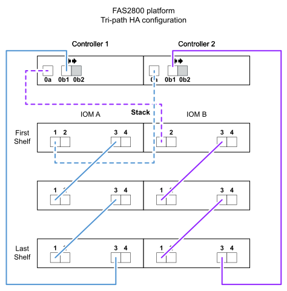

= Exemplos de cabeamento e planilhas de controlador para stack para plataformas com storage interno - gavetas com módulos IOM12/IOM12B
:allow-uri-read: 
:icons: font
:imagesdir: ../media/

[role="lead"]
Você pode usar as planilhas de cabeamento e exemplos de cabeamento completos de controladora a stack para plataformas de cabos com storage interno.

NOTE: Esta informação não se aplica às plataformas FAS25XX.

* Se necessário, consulte a link:install-cabling-rules.html["Regras e conceitos de cabeamento de SAS"] para obter informações sobre configurações compatíveis, conectividade de gaveta a prateleira e conectividade de controlador para compartimento.
* Exemplos de cabeamento mostram os cabos de controlador para stack como sólidos ou tracejados para distinguir as conexões de porta 0b/0B1 do controlador 0a.
+
image::../media/drw_fas2600_controller_to_stack_cable_type_key_IEOPS-947.svg[Chave tipo cabo para plataformas com armazenamento integrado]

* Os exemplos de cabeamento mostram conexões de controlador para stack e de prateleira para prateleira em duas cores diferentes para distinguir a conectividade por meio de IOM A (domínio A) e IOM B (domínio B).
+
image::../media/drw_fas2600_cable_color_key.png[Chave de cor de cabo para plataformas com armazenamento integrado]

== Plataforma FAS2800 em uma configuração de HA multipath sem gavetas externas

O exemplo a seguir mostra que nenhum cabeamento é necessário para acessar a conectividade de HA multipath:

image::../media/drw_fas2800_noshelf_mpha_IEOPS-954.svg[FAS2800 ha multipath sem gavetas externas]

== Plataforma FAS2800 em uma configuração de HA de três caminhos sem gavetas externas

O exemplo de cabeamento a seguir mostra o cabeamento necessário entre as duas controladoras para obter conectividade tri-path:

image::../media/drw_fas2800_noshelf_tpha_IEOPS-955.svg[Fas2800 exemplo de cabeamento de HA com três caminhos sem gavetas externas]

== Plataforma FAS2800 em uma configuração de HA de três caminhos com uma stack de várias shelves

O exemplo de cabeamento e Planilha a seguir usa o par de portas 0a/0B1:

image::../media/drw_fas2800_worksheet_IEOPS-948.svg[Folha de cálculo de cabeamento de HA de três caminhos FAS2800 que mostra pares de portas para a stack 1]

== Plataformas com storage interno em uma configuração de HA multipath com uma stack de várias shelves

O exemplo de cabeamento e Planilha a seguir usa o par de portas 0a/0b:

NOTE: Esta secção não se aplica a sistemas FAS2800 ou FAS25XX.

image::../media/drw_fas2600_mpha_worksheet_IEOPS-1255.svg[Planilha de cabeamento de HA multipath para plataformas com storage interno e uma stack]

image::../media/drw_fas2600_mpha_IEOPS-1256.svg[Exemplo de cabeamento de HA multipath para plataformas com storage interno]

== Configuração multipath da série FAS2600 com uma stack de várias shelves

As seguintes planilhas e exemplos de cabeamento usam o par de portas 0a/0b.

Neste exemplo, o controlador é instalado no slot A do chassi. Quando uma controladora está localizada no slot A do chassi, sua porta de storage interno (0b) está no domínio A (Iom A); portanto, a porta 0b deve se conectar ao domínio A (Iom A) na stack.

image::../media/drw_fas2600_mp_slot_a_worksheet.png[Folha de cálculo de cabeamento de FAS2600 que mostra o par de portas para uma configuração multipath]

image::../media/drw_fas2600_mp_slot_a.png[Exemplo de cabeamento multipath de FAS2600 GbE com controladora no slot do chassi 1]

Neste exemplo, o controlador é instalado no slot B do chassi. Quando uma controladora está localizada no slot B do chassi, sua porta de storage interno (0b) está no domínio B (IOM B); portanto, a porta 0b deve se conetar ao domínio B (IOM B) na stack.

image::../media/drw_fas2600_mp_slot_b_worksheet.png[Folha de cálculo de cabeamento de FAS2600 que mostra o par de portas para uma configuração multipath]

image::../media/drw_fas2600_mp_slot_b.png[Exemplo de cabeamento multipath de FAS2600 GbE com controladora no slot do chassi 2]
