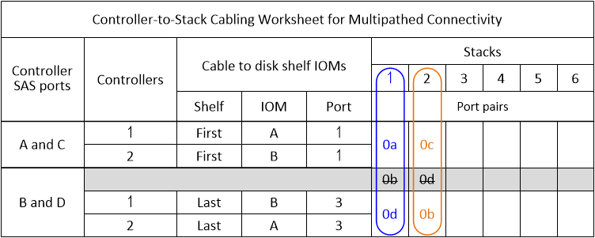
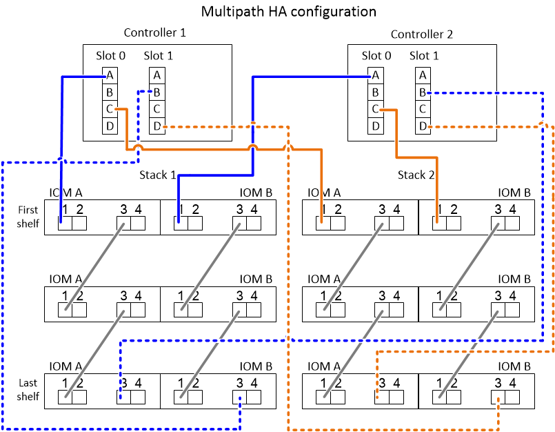

= Exemplos de cabeamento e planilhas de controlador para stack para configurações de HA multipath - gavetas com módulos IOM12/IOM12B
:allow-uri-read: 
:icons: font
:imagesdir: ../media/

[role="lead"]
Você pode usar as planilhas de cabeamento e exemplos de cabeamento de controladora a stack para fazer o cabeamento do seu par de HA como uma configuração de HA multipath.

NOTE: Essas informações se aplicam a plataformas sem armazenamento interno.

* Se necessário, consulte a link:install-cabling-rules.html["Regras e conceitos de cabeamento de SAS"] para obter informações sobre configurações compatíveis, a convenção de numeração de slots do controlador, conectividade de prateleira a prateleira e conectividade de controlador para compartimento (incluindo o uso de pares de portas).
* Se necessário, você pode link:install-cabling-worksheets-how-to-read-multipath.html["Como ler uma Planilha para conexões de cabo controlador para pilha para conetividade multipathed"]consultar .
* Exemplos de cabeamento mostram os cabos de controlador para stack como sólidos ou tracejados para distinguir as conexões de portas A e C das conexões de portas B e D do controlador.
+
image::../media/drw_controller_to_stack_cable_type_key.gif[Chave de tipo de cabo de configuração de HA multipath]

* Os cabos nos exemplos de cabeamento e seus pares de portas correspondentes nas planilhas são codificados por cores para distinguir a conetividade de cada stack no par de HA.
+
image::../media/drw_controller_to_stack_cable_color_key_non2600_4stackcolors.gif[Chave colorida do cabo de configuração de HA multipath]

* Exemplos de planilhas e cabeamento mostram pares de portas de cabeamento na ordem em que são listados na Planilha.

== Planilhas de cabeamento de controladora a stack e exemplos de cabeamento para configurações de HA multipath com HBAs SAS de quatro portas

Você pode usar as planilhas de cabeamento e exemplos de cabeamento completos de controladora a stack para realizar configurações de HA de multipath comuns que possuem HBAs SAS de quatro portas. Essas controladoras não têm portas SAS integradas.

=== Multipath HA com um HBA SAS de quatro portas e uma stack de compartimento único

O exemplo de cabeamento e Planilha a seguir usa o par de portas 1a/1D:

image::../media/drw_worksheet_mpha_slot_1_one_4porthba_one_singleshelf_stack.gif[Folha de cálculo de cabeamento de HA multipath para um HBA SAS de quatro portas e uma pilha de gaveta única]

image::../media/drw_mpha_slot_1_one_4porthba_one_singleshelf_stack.gif[Exemplo de cabeamento de HA multipath para um HBA SAS de quatro portas e uma stack de compartimento único]

=== Multipath HA com um HBA SAS de quatro portas e duas stacks de compartimento único

O exemplo de cabeamento e Planilha a seguir usa pares de portas 1a/1D e 1c/1b:

image::../media/drw_worksheet_mpha_slot_1_one_4porthba_two_singleshelf_stacks.gif[Planilha de cabeamento de HA multipath para um HBA SAS de quatro portas e duas stacks de gaveta única]

image::../media/drw_mpha_slot_1_one_4porthba_two_singleshelf_stacks.gif[Exemplo de cabeamento de HA multipath para um HBA SAS de quatro portas e duas stacks de compartimento único]

=== Multipath HA com dois HBAs SAS de quatro portas e duas stacks de várias shelves

Quatro pares de portas estão disponíveis para esta configuração: 1A/2b, 2a/1D, 1c/2D e 2c/1b. Você pode conetar pares de portas por cabo na ordem em que eles são identificados (listados na Planilha) ou pode fazer o cabeamento de cada outro par de portas (ignorar pares de portas).

NOTE: Quando você tem mais pares de portas do que precisa para fazer o cabeamento das pilhas no sistema, a prática recomendada é ignorar pares de portas para otimizar as portas SAS no sistema. Ao otimizar as portas SAS, você otimiza o desempenho do seu sistema.

O exemplo de cabeamento e Planilha a seguir mostra os pares de portas que estão sendo usados na ordem em que são listados na Planilha: 1A/2b, 2a/1D, 1c/2D e 2c/1b.

image::../media/drw_worksheet_mpha_slots_1_and_2_two_4porthbas_two_stacks.gif[Planilha de cabeamento de HA multipath para dois HBAs SAS de quatro portas e duas stacks de várias shelves]

image::../media/drw_mpha_slots_1_and_2_4porthbas_4_stacks.gif[Exemplo de cabeamento de HA multipath para dois HBAs SAS de quatro portas e duas stacks de várias shelves]

O exemplo de cabeamento e Planilha a seguir mostra pares de portas sendo ignorados para usar cada outro na lista: 1A/2b e 1c/2D.

NOTE: Se uma terceira pilha for adicionada mais tarde, você usará o par de portas que foi ignorado.

image::../media/drw_worksheet_mpha_slots_1_and_2_two_4porthbas_two_stacks_skipped.gif[Planilha de cabeamento de HA multipath para dois HBAs SAS de quatro portas e duas stacks de vários compartimentos usando pares de portas ignorados]

image::../media/drw_mpha_slots_1_and_2_two_4porthbas_two_stacks_skipped.gif[Exemplo de cabeamento de HA multipath para dois HBAs SAS de quatro portas e duas stacks de várias shelves usando pares de portas ignorados]

== Planilhas de cabeamento e exemplos de cabeamento de controladora a stack para configurações de HA multipath com quatro portas SAS integradas

Você pode usar as planilhas de cabeamento e exemplos de cabeamento completos de controladora a stack para realizar configurações de HA multipath comuns que têm quatro portas SAS integradas.

=== Ha multipath com quatro portas SAS integradas e uma stack de compartimento único

O exemplo de cabeamento e Planilha a seguir usa o par de portas 0a/0d:

image::../media/drw_worksheet_mpha_slot_0_4ports_one_singleshelf_stack.gif[Planilha de cabeamento de HA multipath para quatro portas integradas e uma stack de compartimento único]

image::../media/drw_mpha_slot_0_4ports_one_singleshelf_stack.gif[Exemplo de cabeamento de HA multipath para quatro portas integradas e uma stack de compartimento único]

=== Ha multipath com quatro portas SAS integradas e duas stacks de compartimento único

O exemplo de cabeamento e Planilha a seguir usa pares de portas 0a/0d e 0C/0b:

image::../media/drw_mpha_slot_0_4ports_two_singleshelf_stacks.gif[Exemplo de cabeamento de HA multipath para quatro portas integradas e duas stacks de compartimento único]

=== Multipath HA com quatro portas SAS integradas, um SAS HBA de quatro portas e duas stacks de várias shelves

Quatro pares de portas estão disponíveis para esta configuração: 0A/1b, 1a/0d, 0C/1D e 1c/0b. Você pode conetar pares de portas por cabo na ordem em que eles são identificados (listados na Planilha) ou pode fazer o cabeamento de cada outro par de portas (ignorar pares de portas).

NOTE: Quando você tem mais pares de portas do que precisa para fazer o cabeamento das pilhas no sistema, a prática recomendada é ignorar pares de portas para otimizar as portas SAS no sistema. Ao otimizar as portas SAS, você otimiza o desempenho do seu sistema.

O exemplo de cabeamento e Planilha a seguir mostra os pares de portas que estão sendo usados na ordem em que são listados na Planilha: 0A/1b, 1a/0d, 0C/1D e 1c/0b.

image::../media/drw_worksheet_mpha_slots_0_and_1_8ports_4stacks.gif[Planilha de cabeamento de HA multipath para quatro portas SAS integradas, um HBA SAS de quatro portas e duas stacks de vários compartimentos]

image::../media/drw_mpha_slots_0_and_1_8ports_4_stacks.gif[Exemplo de cabeamento de HA multipath para quatro portas SAS integradas, um HBA SAS de quatro portas e duas stacks de várias shelves]

O exemplo de cabeamento e Planilha a seguir mostra pares de portas sendo ignorados para usar cada outro na lista: 0A/1b e 0C/1D.

NOTE: Se uma terceira pilha for adicionada mais tarde, você usará o par de portas que foi ignorado.

image::../media/drw_worksheet_mpha_slots_0_and_1_8ports_two_stacks_skipped.gif[Planilha de cabeamento de HA multipath para quatro portas integradas um HBA SAS de quatro portas e duas pilhas de vários compartimentos usando pares de portas ignorados]

