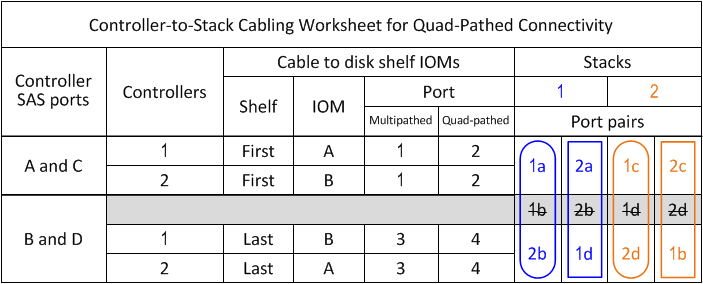
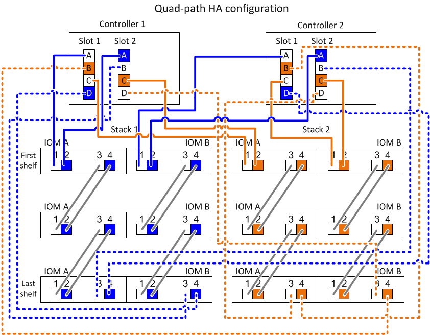

= Leia uma folha de exercícios para conectar o controlador ao stack nos modelos DS212C, DS224C ou DS460C com conectividade de quatro caminhos
:allow-uri-read: 
:icons: font
:imagesdir: ../media/

[role="lead"]
Você pode usar este exemplo para orientar você sobre como ler e aplicar uma planilha preenchida a conjuntos de cabos de gabinetes de discos com módulos IOM12, IOM12B ou IOM12C para conectividade de quatro caminhos.

.Sobre esta tarefa
* Este procedimento faz referência ao exemplo de cabeamento e Planilha a seguir para demonstrar como ler uma Planilha para conexões de controladora a pilha de cabo.
+
A configuração usada neste exemplo é uma configuração HA de quatro caminhos com dois HBAs SAS de quatro portas em cada controlador e duas pilhas de compartimentos de disco com IOM12 módulos.

* Se você tiver uma configuração de controladora única, ignore as subetapas b e d para o cabeamento de uma segunda controladora.
* Se necessário, consulte a link:install-cabling-rules.html["Regras e conceitos de cabeamento de SAS"] para obter informações sobre a convenção de numeração de slots do controlador, a conetividade de prateleira a prateleira e a conectividade de controlador a prateleira (incluindo o uso de pares de portas).

.Passos
. Par de portas de cabo 1a/2b em cada controlador para empilhar 1:
+
Este é o cabeamento multipathed para a pilha 1.

+
.. Controladora de cabos 1 porta 1a para stack 1, primeira gaveta IOM A porta 1.
.. Controladora de cabos 2 porta 1a para stack 1, primeira gaveta IOM B porta 1.
.. Controladora de cabos 1 porta 2b para stack 1, última gaveta IOM B porta 3.
.. Controladora de cabos 2 porta 2b para stack 1, última gaveta IOM A porta 3.

. Par de portas de cabo 2a/1D em cada controlador para empilhar 1:
+
Este é o cabeamento quad-pathed para a pilha 1. Uma vez concluída, a pilha 1 tem conetividade quad-pathed para cada controlador.

+
.. Controladora de cabos 1 porta 2a para stack 1, primeira gaveta IOM A porta 2.
.. Controladora de cabos 2 porta 2a para stack 1, primeira gaveta IOM B porta 2.
.. Controladora de cabos 1 porta 1D para stack 1, última gaveta IOM B porta 4.
.. Controladora de cabos 2 porta 1D para stack 1, última gaveta IOM A porta 4.

. Par de portas de cabo 1c/2D em cada controlador para empilhar 2:
+
Este é o cabeamento multipathed para a pilha 2.

+
.. Controladora de cabos 1 porta 1c para stack 2, primeira gaveta IOM A porta 1.
.. Controladora de cabos 2 porta 1c para stack 2, primeira gaveta IOM B porta 1.
.. Controladora de cabos 1 porta 2D para stack 2, última gaveta IOM B porta 3.
.. Controladora de cabos 2 porta 2D para stack 2, última gaveta IOM A porta 3.

. Par de portas de cabo 2c/1b em cada controlador para empilhar 2:
+
Este é o cabeamento quad-pathed para a pilha 2. Uma vez concluída, a pilha 2 tem conetividade quad-pathed para cada controlador.

+
.. Controladora de cabos 1 porta 2c para stack 2, primeira gaveta IOM A porta 2.
.. Controladora de cabos 2 porta 2c para stack 2, primeira gaveta IOM B porta 2.
.. Controladora de cabos 1 porta 1b para stack 2, última gaveta IOM B porta 4.
.. Controladora de cabos 2 porta 1b para stack 2, última gaveta IOM A porta 4.

