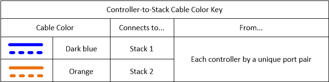

= Exemplo de cabeamento e Planilha de cabeamento de controladora a stack para uma configuração HA de quatro caminhos com dois HBAs SAS de quatro portas - compartimentos com módulos IOM12/IOM12B
:allow-uri-read: 
:icons: font
:imagesdir: ../media/

[role="lead"]
Você pode usar a Planilha de cabeamento e o exemplo de cabeamento completo de controladora para stack para realizar uma configuração de HA de quatro caminhos que tenha dois HBAs SAS de quatro portas.

* Se necessário, consulte a link:install-cabling-rules.html["Regras de cabeamento de SAS"] para obter informações sobre configurações compatíveis, a convenção de numeração de slots do controlador, conectividade de prateleira a prateleira e conectividade de controlador para compartimento (incluindo o uso de pares de portas).
* Se necessário, você pode link:install-cabling-worksheets-how-to-read-quadpath.html["Como ler uma Planilha para conexões de controlador para pilha de cabo para conetividade quad-pathed"]consultar .
* O exemplo de cabeamento mostra os cabos de controlador para stack como sólidos ou tracejados para distinguir as conexões das portas A e C das conexões das portas B e D do controlador.
+
image::../media/drw_controller_to_stack_cable_type_key.gif[Chave de tipo de cabo para a controladora para empilhar o cabeamento]

* Os cabos nos exemplos de cabeamento e seus pares de portas correspondentes nas planilhas são codificados por cores para distinguir a conetividade de cada stack no par de HA.
+

* O exemplo de cabeamento distingue visualmente os dois conjuntos de cabeamento multipathed necessários para alcançar conetividade quad-pathed para cada controladora para cada stack em um par de HA ou configuração de controladora única.
+
O primeiro conjunto de cabeamento multipathed é chamado de ""sultipathed". O segundo conjunto de cabeamento multipathed é chamado de "quad-pathed". O segundo conjunto de cabeamento é conhecido como "quad-pathed" porque a conclusão deste conjunto de cabeamento dá a você a conetividade quad-pathed.

+
image::../media/drw_controller_to_stack_quad_pathed_connectivity_key.gif[Chave colorida para conetividade quad pathed]

* O exemplo de Planilha mostra os pares de portas designados para cabeamento multipathed ou cabeamento quad-pathed para a pilha aplicável.
+
Cada par de portas designado para cabeamento multipathed é circundado por um oval que é a cor associada à pilha para a qual é cabeado. Cada par de portas designado para o cabeamento de caminhos quádruplos é circundado por um retângulo que é a cor associada à pilha para a qual é cabeado.

== HA de quatro vias com dois HBAs SAS de quatro portas e duas pilhas de várias prateleiras

O exemplo de Planilha e cabeamento a seguir usa pares de portas 1a/2b (multipathed) e 2a/1D (quatro pathed) para a pilha 1, e pares de portas 1c/2D (multipathed) e 2c/1b (quatro pathed) para stack2.

image::../media/drw_worksheet_qpha_slots_1_and_2_two_4porthbas_two_stacks_nau.gif[Folha de cálculo de cabeamento para quad path HA]

image::../media/drw_qpha_slots_1_and_2_two_4porthbas_two_stacks_nau.gif[Quad path HA com dois HBAs SAS de quatro portas e duas stacks de várias prateleiras]
