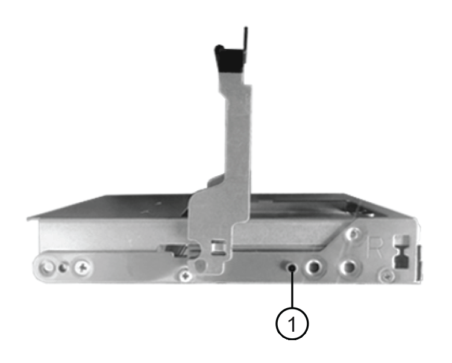

= Adicione gavetas IOM12/IOM12BU de forma dinâmica a uma stack de IOM6 gavetas
:allow-uri-read: 
:icons: font
:imagesdir: ../media/

[role="lead"]
Quando for necessário storage adicional, você pode adicionar gavetas IOM12/IOM12B (gavetas SAS com módulos de IOM12/IOM12B) a uma stack de IOM6 gavetas (gavetas SAS com IOM6 módulos), o que significa que você pode combinar uma stack.

== Requisitos para um hot-add

Seu par de HA, controladora única ou configuração Stretch MetroCluster (sistema) precisa atender a certos requisitos antes de adicionar gavetas IOM12/IOM12B a uma stack de IOM6 gavetas.

NOTE: Para configurações MetroCluster conetadas em ponte, <<Requisitos para um hot-add em configurações MetroCluster conetadas em ponte>>consulte .

* Seu sistema e sua versão do ONTAP devem ser compatíveis com uma combinação de IOM6 gavetas e IOM12/IOM12B no mesmo stack (uma stack mista).
+
Você pode verificar o suporte usando um dos seguintes métodos:

+
** Digite o ``run local sysconfig`` comando, no prompt de administrador de qualquer controlador.
+
Se o campo suporte de pilha mista SAS2/SAS3 não aparecer na saída ou tiver um valor de "nenhum", o sistema não suporta pilhas mistas.

+
Se "All" (todos) aparecer no campo Mixed Stack Support (suporte a pilha mista) SAS2/SAS3, o sistema suporta pilhas mistas.

+
Se "bridge-attached" aparecer no campo SAS2/SAS3 Mixed Stack Support (suporte de pilha mista), o sistema só suporta pilhas mistas se as prateleiras de armazenamento estiverem conetadas por meio de um ATTO FibreBridge.

** Vá para Hardware Universe e navegue até as informações da sua plataforma.
+
https://hwu.netapp.com["NetApp Hardware Universe"^]

* Se você estiver adicionando um compartimento a uma configuração do MetroCluster, a configuração deverá atender a todos os requisitos nos Guias de Instalação e Configuração do MetroCluster.
+
http://docs.netapp.com/ontap-9/topic/com.netapp.doc.dot-mcc-inst-cnfg-ip/home.html["Guia de instalação e configuração do IP do MetroCluster"^]

+
http://docs.netapp.com/ontap-9/topic/com.netapp.doc.dot-mcc-inst-cnfg-stretch/home.html["Guia de instalação e configuração do ONTAP 9 Stretch MetroCluster"^]

+
http://docs.netapp.com/ontap-9/topic/com.netapp.doc.dot-mcc-inst-cnfg-fabric/home.html["Guia de instalação e configuração do MetroCluster conectado à ONTAP 9 Fabric"^]

* A pilha de IOM6 gavetas, à qual você está adicionando uma gaveta IOM12/IOM12B, precisa ser cabeada por cabos de cobre SAS (para todas as conexões de gaveta a gaveta e controlador a stack).
+
Os cabos óticos SAS não são suportados em uma pilha mista.

+

NOTE: Se a stack de IOM6 shelf for cabeada por cabos óticos SAS, não será possível adicionar uma gaveta IOM12/IOM12B. Contacte o seu representante de vendas da NetApp.

* Seu sistema precisa ter menos que o número máximo de unidades com suporte, pelo menos o número de unidades capazes de ser instaladas nas gavetas IOM12/IOM12B que você está adicionando a quente.
+
Você não pode ter excedido o número máximo de unidades compatíveis com o seu sistema depois de adicionar gavetas IOM12/IOM12B.

+
https://hwu.netapp.com["NetApp Hardware Universe"^]

* O sistema não pode ter mensagens de erro de cabeamento SAS.
+
Você deve corrigir quaisquer erros de cabeamento usando as ações corretivas fornecidas pelas mensagens de erro.

+
https://mysupport.netapp.com/site/tools["NetApp Downloads: Config Advisor"^]

* Você precisa ter solicitado e recebido as gavetas IOM12/IOM12B e o número e os tipos apropriados de cabos de cobre SAS.
+
As prateleiras IOM12/IOM12B usam conetores mini-SAS HD. As prateleiras IOM6 usam conetores QSFP.

== Requisitos para um hot-add em configurações MetroCluster conetadas em ponte

Se você estiver adicionando gavetas IOM12/IOM12B a uma stack de IOM6 gavetas conetadas usando um par de bridges ATTO FibreBridge em uma configuração MetroCluster, o sistema precisa atender a certos requisitos.

* Se as portas SAS em ponte estiverem disponíveis na configuração atual, você deverá adicionar as gavetas IOM12/IOM12B como uma pilha separada.
+
Use todas as portas de ponte antes de misturar módulos IOM12/IOM12B e IOM6 em uma pilha.

* Seu sistema e sua versão do ONTAP devem ser compatíveis com uma combinação de IOM6 gavetas e IOM12/IOM12B no mesmo stack (uma stack mista).
+
Você pode verificar o suporte usando um dos seguintes métodos:

+
** Digite o ``run local sysconfig`` comando no prompt de administrador de qualquer controlador.
+
Se o campo suporte a pilha mista SAS2/SAS3 não aparecer na saída ou tiver um valor de nenhum, o sistema não suporta pilhas mistas.

+
Se qualquer outra coisa aparecer no campo suporte de pilha mista SAS2/SAS3, como tudo ou conetado em ponte, o sistema suporta pilhas mistas.

** Vá para Hardware Universe e navegue até as informações da sua plataforma.
+
https://hwu.netapp.com["NetApp Hardware Universe"^]

* A configuração deve atender a todos os requisitos nos Guias de Instalação e Configuração do MetroCluster.
+
https://docs.netapp.com/us-en/ontap-metrocluster/install-stretch/index.html["Instalação e Configuração de uma configuração Stretch MetroCluster"^]

+
https://docs.netapp.com/us-en/ontap-metrocluster/install-fc/index.html["Instalação e configuração de uma configuração MetroCluster conetada à malha"^]

* A pilha de IOM6 gavetas, à qual você está adicionando uma gaveta IOM12/IOM12B, precisa ser cabeada por cabos de cobre SAS (para todas as conexões de gaveta a gaveta e controlador a stack).
+
Os cabos óticos SAS não são suportados em uma pilha mista.

+

NOTE: Se a stack de IOM6 shelf for cabeada por cabos óticos SAS, não será possível adicionar uma gaveta IOM12/IOM12B. Contacte o seu representante de vendas da NetApp.

* Sua configuração deve ter menos do que o número máximo de unidades suportadas para uma porta de ponte.
* Você precisa ter solicitado e recebido as gavetas IOM12/IOM12B e o número e os tipos apropriados de cabos de cobre SAS.
+
As prateleiras IOM12/IOM12B usam conetores mini-SAS HD. As prateleiras IOM6 usam conetores QSFP.

* A ponte deve estar executando a versão de firmware 3,16/4,16 e posterior.

== Considerações para um hot-add

Você deve se familiarizar com os aspetos e as melhores práticas sobre este procedimento antes de adicionar prateleiras IOM12/IOM12B a uma pilha de IOM6 prateleiras.

=== Considerações gerais

* É altamente recomendável que as prateleiras IOM12/IOM12B que você está adicionando a quente estejam executando a versão de firmware 0260 ou posterior, antes de enviá-las ao seu sistema.
+
Ter uma versão com suporte do firmware do compartimento protege contra problemas de acesso à pilha de storage se você tiver cabeado o compartimento de hot-added para a pilha incorretamente.

+
Depois de baixar o firmware da gaveta IOM12/IOM12B para as prateleiras, verifique se a versão do firmware é 0260 ou posterior, digitando o `storage shelf show -module` comando no console de qualquer controladora.

* A consolidação de pilha sem interrupções não é suportada.
+
Você não pode usar este procedimento para adicionar gavetas de disco hot-removed de outra stack no mesmo sistema quando o sistema está ligado e fornecendo dados (e/S está em andamento).

* Você pode usar este procedimento para adicionar gavetas de disco hot-removidas no mesmo sistema MetroCluster se a gaveta afetada tiver agregados espelhados.
* Quando você adiciona prateleiras com módulos IOM12/IOM12B a uma pilha de prateleiras com IOM6 módulos, o desempenho de toda a pilha opera a 6 Gbps (é executado na velocidade comum mais baixa).
+
Se as prateleiras que você está adicionando a quente são prateleiras que foram atualizadas de IOM3 ou IOM6 módulos para IOM12/IOM12B módulos, a pilha opera a 12 Gbps; no entanto, os recursos de disco e backplane da prateleira podem limitar o desempenho do disco a 3 Gbps ou 6 Gbps.

* Depois de ter cabeado uma gaveta hot-Added, o ONTAP reconhece a gaveta:
+
** A propriedade da unidade é atribuída se a atribuição automática da unidade estiver ativada.
** O firmware da gaveta (IOM) e da unidade devem ser atualizados automaticamente, se necessário.
+

NOTE: As atualizações de firmware podem levar até 30 minutos.

=== Considerações de práticas recomendadas

* *Prática recomendada:* a prática recomendada é ter versões atuais do firmware da gaveta (IOM) e do firmware da unidade em seu sistema antes de adicionar uma gaveta a quente.
+
https://mysupport.netapp.com/site/downloads/firmware/disk-shelf-firmware["Downloads do NetApp: Firmware da gaveta de disco"^]

+
https://mysupport.netapp.com/site/downloads/firmware/disk-drive-firmware["Downloads do NetApp: Firmware da unidade de disco"^]

NOTE: Não reverta o firmware para uma versão que não suporte a gaveta e seus componentes.

* *Prática recomendada:* a melhor prática é ter a versão atual do Pacote de Qualificação de disco (DQP) instalada antes de adicionar uma prateleira a quente.
+
Ter a versão atual do DQP instalada permite que seu sistema reconheça e use unidades recém-qualificadas. Isso evita mensagens de eventos do sistema sobre ter informações de unidade não atuais e prevenção do particionamento de unidade porque as unidades não são reconhecidas. O DQP também notifica você sobre o firmware da unidade não atual.

+
https://mysupport.netapp.com/site/downloads/firmware/disk-drive-firmware/download/DISKQUAL/ALL/qual_devices.zip["NetApp Downloads: Pacote de Qualificação de disco"^]

* *Prática recomendada:* a melhor prática é executar o Active IQ Config Advisor antes e depois de adicionar uma prateleira.
+
Executar o Active IQ Config Advisor antes de adicionar uma gaveta fornece um snapshot da conectividade SAS existente, verifica versões de firmware da gaveta (IOM) e permite verificar uma ID da gaveta que já está em uso no sistema. Executar o Active IQ Config Advisor após adicionar um compartimento a quente permite verificar se as gavetas estão cabeadas corretamente e se as IDs de gaveta são exclusivas do sistema.

+
https://mysupport.netapp.com/site/tools["NetApp Downloads: Config Advisor"^]

* *Melhor prática:* a melhor prática é ter ACP em banda (IBACP) em execução no seu sistema.
+
** Para sistemas em que o IBACP está sendo executado, o IBACP é ativado automaticamente em prateleiras IOM12/IOM12B com hot-added.
** Para sistemas nos quais o ACP fora da banda está habilitado, os recursos de ACP não estão disponíveis nas gavetas IOM12/IOM12B.
+
Você deve migrar para o IBACP e remover o cabeamento ACP fora da banda.

** Se o seu sistema não estiver executando o IBACP e o seu sistema atender aos requisitos do IBACP, você pode migrar seu sistema para o IBACP antes de adicionar uma gaveta de IOM12 TB a quente.
+
https://kb.netapp.com/Advice_and_Troubleshooting/Data_Storage_Systems/FAS_Systems/In-Band_ACP_Setup_and_Support["Instruções para migrar para o IBACP"^]

+

NOTE: As instruções de migração fornecem os requisitos do sistema para o IBACP.

== Prepare-se para atribuir manualmente a propriedade da unidade para um hot-add

Se você estiver atribuindo manualmente a propriedade da unidade para as gavetas IOM12/IOM12B que você está adicionando a quente, será necessário desativar a atribuição automática de unidade se ela estiver ativada.

.Antes de começar
Você precisa atender aos requisitos do sistema.

<<Requisitos para um hot-add>>

<<Requisitos para um hot-add em configurações MetroCluster conetadas em ponte>>

.Sobre esta tarefa
Se você tiver um par de HA, precisará atribuir manualmente a propriedade da unidade se as unidades na gaveta forem de propriedade de ambos os módulos da controladora.

.Passos
. Verifique se a atribuição automática de unidades está ativada: `storage disk option show`
+
Se você tiver um par de HA, poderá inserir o comando em qualquer um dos módulos do controlador.

+
Se a atribuição automática de unidade estiver ativada, a saída será exibida `on` na coluna "'Auto Assign'" (para cada módulo do controlador).

. Se a atribuição automática de condução estiver ativada, desative-a: `storage disk option modify -node _node_name_ -autoassign off`
+
Se você tiver um par de HA ou uma configuração de MetroCluster de dois nós, desative a atribuição automática de unidades em ambos os módulos do controlador.

== Instale as gavetas para adicionar quente

Para cada gaveta que você está adicionando quente, instale a gaveta em um rack, conete os cabos de energia, ligue a gaveta e defina a ID da gaveta.

. Instale o kit de montagem em rack (para instalações de rack de dois ou quatro colunas) fornecido com a prateleira de disco usando o folheto de instalação fornecido com o kit.
+
[NOTE]
====
Se você estiver instalando várias gavetas de disco, você deve instalá-las da parte inferior para a parte superior do rack para a melhor estabilidade.

====
+
[CAUTION]
====
Não coloque a prateleira de disco em um rack de telecomunicações; o peso da prateleira de disco pode fazer com que ela caia no rack sob seu próprio peso.

====
. Instale e fixe o compartimento de disco nos suportes de suporte e no rack usando o folheto de instalação fornecido com o kit.
+
Para tornar um compartimento de disco mais leve e fácil de manobrar, remova as fontes de alimentação e os módulos de e/S (IOMs).

+
Para gavetas de disco de DS460C TB, embora as unidades sejam embaladas separadamente, o que torna a prateleira mais leve, uma prateleira vazia de DS460C kg ainda pesa aproximadamente 132 lb (60kg lb); portanto, tenha o seguinte cuidado ao mover uma prateleira.

+

CAUTION: Recomenda-se que utilize um elevador mecanizado ou quatro pessoas utilizando as pegas de elevação para mover com segurança uma prateleira DS460C vazia.

+
A sua remessa DS460C foi embalada com quatro alças de elevação destacáveis (duas para cada lado). Para utilizar as pegas de elevação, instale-as inserindo as patilhas das pegas nas ranhuras laterais da prateleira e empurrando-as para cima até encaixarem no lugar. Em seguida, ao deslizar a prateleira do disco para os trilhos, você descola um conjunto de alças de cada vez usando o trinco do polegar. A ilustração a seguir mostra como conetar uma alça de elevação.

+
image::../media/drw_ds460c_handles.gif[Instalar as pegas de elevação]

. Reinstale todas as fontes de alimentação e IOMs removidas antes de instalar o compartimento de disco no rack.
. Se você estiver instalando um compartimento de disco DS460C, instale as unidades nas gavetas da unidade; caso contrário, vá para a próxima etapa.
+
[NOTE]
====
Utilize sempre uma pulseira antiestática ligada à terra a uma superfície não pintada no chassis do compartimento de armazenamento para evitar descargas estáticas.

Se uma pulseira não estiver disponível, toque numa superfície não pintada no chassis do compartimento de armazenamento antes de manusear a unidade de disco.

====
+
Se você adquiriu um compartimento parcialmente preenchido, o que significa que o compartimento tem menos de 60 unidades compatíveis, para cada gaveta, instale as unidades da seguinte forma:

+
** Instale as primeiras quatro unidades nos slots dianteiros (0, 3, 6 e 9).
+

NOTE: *Risco de mau funcionamento do equipamento:* para permitir um fluxo de ar adequado e evitar o sobreaquecimento, instale sempre as quatro primeiras unidades nas ranhuras dianteiras (0, 3, 6 e 9).

** Para as unidades restantes, distribua-as uniformemente em cada gaveta.

A ilustração a seguir mostra como as unidades são numeradas de 0 a 11 em cada gaveta de unidade dentro da gaveta.

image::../media/dwg_trafford_drawer_with_hdds_callouts.gif[Numeração da unidade]

. Abra a gaveta superior da prateleira.
. Remova uma unidade de seu saco ESD.
. Levante a alavanca do came na unidade para a vertical.
. Alinhe os dois botões levantados em cada lado do suporte da unidade com a folga correspondente no canal da unidade na gaveta da unidade.
+

+
[cols="10,90"]
|===

| image:../media/icon_round_1.png["Legenda número 1"] | Botão levantado no lado direito do suporte da transmissão 
|===
. Baixe a unidade em linha reta para baixo e, em seguida, rode a pega do came para baixo até que a unidade encaixe no devido lugar sob o trinco de desbloqueio laranja.
. Repita as subetapas anteriores para cada unidade na gaveta.
+
Você deve ter certeza de que os slots 0, 3, 6 e 9 em cada gaveta contêm unidades.

. Empurre cuidadosamente a gaveta da unidade de volta para dentro do compartimento.
+
|===

 a| 
image:../media/2860_dwg_e2860_de460c_gentle_close.gif["Fechar cuidadosamente a gaveta"]

 a| 

CAUTION: *Possível perda de acesso aos dados:* nunca bata a gaveta fechada. Empurre a gaveta lentamente para dentro para evitar estressar a gaveta e causar danos à matriz de armazenamento.

|===
. Feche a gaveta da unidade empurrando ambas as alavancas em direção ao centro.
. Repita estas etapas para cada gaveta na gaveta de disco.
. Fixe a moldura frontal.
+
.. Se você estiver adicionando várias gavetas de disco, repita as etapas anteriores para cada compartimento de disco que você está instalando.
.. Conete as fontes de alimentação de cada compartimento de disco:

. Conete os cabos de alimentação primeiro às gavetas de disco, fixando-os no lugar com o retentor do cabo de alimentação e, em seguida, conete os cabos de alimentação a diferentes fontes de alimentação para obter resiliência.
. Ligue as fontes de alimentação de cada compartimento de disco e aguarde até que as unidades de disco sejam acionadas.
+
.. Defina o ID do compartimento para cada compartimento que você está adicionando a um ID exclusivo na configuração de par de HA ou controladora única.
+
Um ID válido do compartimento é de 00 a 99. Recomenda-se que você defina as IDs de gaveta para que as IOM6 gavetas usem números menores (1 - 9) e as gavetas IOM12/IOM12B usem números maiores (10 e posteriores).

+
Se você tiver um modelo de plataforma com storage integrado, as IDs de gaveta deverão ser exclusivas na gaveta interna e nas gavetas conetadas externamente. Recomenda-se que defina a prateleira interna como 0. Nas configurações IP do MetroCluster, apenas os nomes dos compartimentos externos se aplicam e, portanto, os nomes dos compartimentos não precisam ser exclusivos.

. Se necessário, verifique as IDs de gaveta que já estão em uso executando o Active IQ Config Advisor.
+
https://mysupport.netapp.com/site/tools["NetApp Downloads: Config Advisor"^]

+
Você também pode executar o `storage shelf show -fields shelf-id` comando para ver uma lista de IDs de gaveta já em uso (e duplicados, se houver) no sistema.

. Acesse o botão ID da prateleira atrás da tampa da extremidade esquerda.
. Altere o primeiro número do ID do compartimento pressionando e mantendo pressionado o botão laranja até que o primeiro número no visor digital pisque, o que pode levar até três segundos.
. Prima o botão para avançar o número até atingir o número pretendido.
. Repita as subetapas c e d para o segundo número.
. Saia do modo de programação pressionando e mantendo pressionado o botão até que o segundo número pare de piscar, o que pode levar até três segundos.
. Ligue o compartimento para fazer com que o ID do compartimento entre em vigor.
+
Tem de desligar ambos os interrutores de alimentação, aguardar 10 segundos e, em seguida, ligá-los novamente para concluir o ciclo de alimentação.

. Repita as subetapas b a g para cada prateleira que você está adicionando a quente.

== Prateleiras de cabos para adicionar quente

A forma como você faz o cabeamento de uma gaveta IOM12/IOM12B a uma stack de IOM6 gavetas depende se a gaveta IOM12/IOM12B é a gaveta inicial de IOM12/IOM12B, o que significa que nenhuma outra gaveta IOM12/IOM12B existe na stack ou se ela é uma gaveta adicional de IOM12/IOM12B para uma stack mista existente, o que significa que uma ou mais gavetas IOM12/IOM12B já existem na stack. Isso também depende se a stack tem conectividade de multipath, HA de três caminhos, multipath, HA de caminho único ou de caminho único.

.Antes de começar
* Você precisa atender aos requisitos do sistema.
+
<<Requisitos para um hot-add>>

* Deve ter concluído o procedimento de preparação, se aplicável.
+
<<Prepare-se para atribuir manualmente a propriedade da unidade para um hot-add>>

* Você precisa ter instalado as gavetas, ligado e definido as IDs das gavetas.
+
<<Instale as gavetas para adicionar quente>>

.Sobre esta tarefa
* Você sempre adiciona gavetas IOM12/IOM12BU à última gaveta lógica em uma stack para manter uma transição de velocidade única na stack.
+
Ao adicionar gavetas IOM12/IOM12BU de alta velocidade à última gaveta lógica em uma stack, as IOM6 gavetas permanecem agrupadas e as gavetas IOM12/IOM12BU permanecem agrupadas para que haja uma transição de velocidade única entre os dois grupos de gavetas.

+
Por exemplo:

+
** Em um par de HA, uma transição de velocidade única dentro de uma stack com duas gavetas IOM6 e duas gavetas IOM12/IOM12B é descrita como:
+
 Controller <-> IOM6 <-> IOM6 <---> IOM12/IOM12B <-> IOM12/IOM12B <-> Controller
** Em um par de HA com storage interno (IOM12E/IOM12G), uma transição de velocidade única em uma stack que tenha duas gavetas IOM12/IOM12B e duas gavetas IOM6 é a figura:
+
 IOM12E 0b/IOM12G 0b1 <-> IOM12/IOM12B <-> IOM12/IOM12B <---> IOM6 <-> IOM6 <-> IOM12E 0a/IOM12G 0a
+
A porta de armazenamento interno 0b/0B1 é a porta do armazenamento interno (expansor) e como ela se coneta à prateleira IOM12/IOM12B (a última prateleira na pilha), o grupo de prateleiras IOM12/IOM12B é mantido em conjunto e uma única transição é mantida através da pilha e armazenamento interno IOM12E/IOM12G.

* Apenas uma transição de velocidade única é suportada em uma pilha mista. Não é possível ter transições de velocidade adicionais. Por exemplo, você não pode ter duas transições de velocidade dentro de uma pilha, que é representado como:
+
 Controller <-> IOM6 <-> IOM6 <---> IOM12/IOM12B <-> IOM12/IOM12B <---> IOM6 <-> Controller
* Você pode adicionar IOM6 gavetas a uma stack misto. No entanto, é necessário adicioná-los ao lado da stack com as IOM6 gavetas (grupo existente de IOM6 gavetas) para manter a transição de velocidade única na stack.
* Você pode escolher as gavetas a cabo IOM12/IOM12B conetando as portas SAS no caminho IOM A primeiro e, em seguida, repita as etapas de cabeamento para o caminho IOM B, conforme aplicável à conectividade de sua stack.
+

NOTE: Em uma configuração MetroCluster, você não pode usar o caminho IOM B.

* A prateleira inicial de IOM12/IOM12B (a prateleira que se coneta ao último compartimento lógico de IOM6) sempre se coneta às portas de círculo de IOM6 prateleiras (não portas quadradas).
* Os conetores de cabo SAS são chaveados; quando orientados corretamente para uma porta SAS, o conetor se encaixa no lugar.
+
Para prateleiras, você insere um conetor de cabo SAS com a aba de puxar orientada para baixo (na parte inferior do conetor). Para controladores, a orientação das portas SAS pode variar dependendo do modelo da plataforma; portanto, a orientação correta do conetor do cabo SAS varia.

* Você pode consultar a ilustração a seguir para o cabeamento de gavetas IOM12/IOM12BU em uma stack de IOM6 shelves em uma configuração que não esteja usando pontes FC para SAS.
+
Essa ilustração é específica de uma stack com conectividade de HA multipath. No entanto, o conceito de cabeamento pode ser aplicado a stacks com multipath, HA de três caminhos, HA de caminho único, conectividade de caminho único e configurações Stretch MetroCluster.

+
image::../media/drw_sas2_sas3_mixed_stack.png[Cabeamento de stack misto multipath]

* Você pode consultar a ilustração a seguir para o cabeamento de gavetas IOM12/IOM12BU em uma stack de IOM6 shelves em uma configuração MetroCluster conetada em ponte. image:../media/hot_adding_iom12_shelves_to_iom6_stack_in_bridge_attached_config.png["Cabeamento de stack misto em uma configuração conetada à ponte"]

.Passos
. Identifique fisicamente a última prateleira lógica na pilha.
+
Dependendo do modelo da sua plataforma e da conectividade de stack (multipath, HA de três caminhos, multipath, HA de caminho único ou caminho único), o último compartimento lógico é que tem conexões controladora a stack a partir das portas SAS B e D, ou é o compartimento que não tem conexões com nenhuma controladora (porque a conectividade de controladora a stack é para o topo lógico da stack, por meio das portas SAS C).

. Se a gaveta IOM12/IOM12B que você está adicionando a quente for a prateleira inicial IOM12/IOM12B que está sendo adicionada à pilha IOM6, o que significa que nenhuma outra gaveta IOM12/IOM12B existe na pilha de prateleiras IOM6, conclua as subetapas aplicáveis.
+

NOTE: Certifique-se de que espera pelo menos 70 segundos entre desligar um cabo e voltar a ligá-lo e quando estiver a substituir um cabo por outro.

+
Caso contrário, vá para o passo 3.

+
[cols="2*"]
|===
| Se a conetividade da pilha IOM6 for... | Então... 

 a| 
Ha multipath, HA de três caminhos, HA de multipath ou de caminho único com conectividade de controlador para o último compartimento lógico (incluindo configurações Stretch MetroCluster)
 a| 
.. Desconete o cabo controlador para stack da última IOM6 gaveta IOM A porta Circle para a controladora ou ponte.
+
Anote a porta do controlador.

+
Coloque o cabo de lado. Já não é necessário.

+
Caso contrário, vá para a subetapa e..

.. Faça a conexão de gaveta a prateleira entre a última porta IOM A de IOM6 compartimentos (da subetapa a) e a nova porta IOM A de IOM12/IOM12B shelf IOM A 1.
+
Use um cabo SAS de cobre QSFP-to-Mini-SAS HD.

.. Se você estiver adicionando mais uma gaveta de IOM12/IOM12B, faça o cabo da conexão de gaveta a prateleira entre a gaveta de IOM12/IOM12B IOM A porta 3, da gaveta que você acabou de cabear e a próxima gaveta de IOM12/IOM12B IOM A porta 1.
+
Use um cabo HD SAS Mini-SAS HD-to-Mini-SAS de cobre.

+
Caso contrário, vá para o próximo subpasso.

.. Restabelecer a conexão controladora para stack por cabeamento da mesma porta na controladora ou ponte (na etapa a) para a nova última gaveta IOM A porta 3 de IOM12 TB/IOM12B TB.
+
Use um cabo SAS QSFP-to-Mini-SAS HD de cobre ou um cabo HD Mini-SAS HD-to-Mini-SAS, conforme apropriado para o tipo de porta no controlador.

.. Repita as subetapas de a a d para IOM B.
+
Caso contrário, vá para o passo 4.

 a| 
Conetividade conetada em ponte em uma configuração MetroCluster
 a| 
.. Desconete o cabo de ponte para pilha inferior da última IOM6 gaveta IOM A porta de círculo para a ponte.
+
Anote o porto da ponte.

+
Coloque o cabo de lado. Já não é necessário.

+
Caso contrário, vá para a subetapa e..

.. Faça a conexão de gaveta a prateleira entre a última porta IOM A de IOM6 compartimentos (da subetapa a) e a nova porta IOM A de IOM12/IOM12B shelf IOM A 1.
+
Use um cabo SAS de cobre QSFP-to-Mini-SAS HD.

.. Se você estiver adicionando mais uma gaveta de IOM12/IOM12B, faça o cabo da conexão de gaveta a prateleira entre a gaveta de IOM12/IOM12B IOM A porta 3, da gaveta que você acabou de cabear e a próxima gaveta de IOM12/IOM12B IOM A porta 1.
+
Use um cabo HD SAS Mini-SAS HD-to-Mini-SAS de cobre.

+
Caso contrário, vá para o próximo subpasso.

.. Repita as subetapas b e c para fazer o cabeamento das conexões de prateleira a prateleira para IOM B.
.. Restabeleça a conexão ponte inferior para pilha por cabeamento da mesma porta na ponte (na subetapa a) para a nova última gaveta IOM A porta 3 de IOM12 TB/IOM12B TB.
+
Use um cabo SAS QSFP-to-Mini-SAS HD de cobre ou um cabo HD Mini-SAS HD-to-Mini-SAS, conforme apropriado para o tipo de porta no controlador.

.. Avance para o passo 4.

 a| 
Ha de caminho único ou caminho único sem conectividade de controlador para o último compartimento lógico
 a| 
.. Faça a conexão de gaveta a prateleira entre a última porta IOM A de IOM6 andares e a nova porta Iom A de IOM12/IOM12B gaveta IOM A 1.
+
Use um cabo SAS de cobre QSFP-to-Mini-SAS HD.

.. Repita o subpasso acima para IOM B.
.. Se você estiver adicionando mais uma prateleira IOM12/IOM12B, repita as subetapas a e b..
+
Caso contrário, vá para o passo 4.

|===
. Se a gaveta IOM12/IOM12B que você está adicionando a quente for uma gaveta adicional de IOM12/IOM12B a uma pilha mista existente, o que significa que uma ou mais prateleiras IOM12/IOM12B já existem na pilha, conclua as subetapas aplicáveis.
+

NOTE: Certifique-se de que espera pelo menos 70 segundos entre desligar um cabo e voltar a ligá-lo e se estiver a substituir um cabo por um cabo mais longo.

+
[cols="2*"]
|===
| Se a conetividade de pilha mista for... | Então... 

 a| 
HA multipath, HA de três caminhos, multipath ou HA de caminho único com conectividade de controladora à última gaveta lógica ou conectividade com conexão de ponte em uma configuração MetroCluster
 a| 
.. Mova o cabo controlador para stack da última gaveta IOM A de IOM12/IOM12BU 3 para a mesma porta na nova última gaveta de IOM12/IOM12BU.
.. Se você estiver adicionando uma gaveta IOM12/IOM12B, faça o cabeamento da conexão de prateleira a prateleira entre a antiga última gaveta IOM A porta 3 de IOM12/IOM12B até a nova última gaveta IOM A porta 1 de IOM12/IOM12B.
+
Use um cabo HD SAS Mini-SAS HD-to-Mini-SAS de cobre.

+
Caso contrário, vá para o próximo subpasso.

.. Se você estiver adicionando mais de uma gaveta IOM12/IOM12B, faça o cabeamento da conexão de prateleira a prateleira entre a antiga última gaveta IOM A porta 3 de IOM12/IOM12B e a próxima gaveta IOM A porta 1 de IOM12/IOM12B e, em seguida, repita isso para quaisquer gavetas IOM12/IOM12B adicionais.
+
Use cabos de cobre SAS Mini-SAS HD-to-Mini-SAS adicionais.

+
Caso contrário, vá para o próximo subpasso.

.. Repita as subetapas de a a c para IOM B.
+
Caso contrário, vá para o passo 4.

 a| 
Conetividade conetada em ponte em uma configuração MetroCluster
 a| 
.. Mova o cabo ponte-a-stack inferior da antiga última prateleira IOM12/IOM12B para a mesma porta na nova última prateleira IOM12/IOM12B.
.. Faça a conexão de gaveta a prateleira entre a antiga última gaveta IOM A porta 3 de IOM12/IOM12B e a próxima gaveta IOM A porta 1 de IOM12/IOM12B, e repita isso para quaisquer gavetas adicionais de IOM12/IOM12B.
+
Use um cabo HD SAS Mini-SAS HD-to-Mini-SAS de cobre.

.. Faça a conexão de gaveta a prateleira entre a antiga porta IOM B de IOM12/IOM12B shelf 3 e a próxima porta IOM B de IOM12/IOM12B shelf 1, e repita isso para quaisquer gavetas adicionais de IOM12/IOM12B.
.. Avance para o passo 4.

 a| 
Ha de caminho único ou caminho único sem conectividade de controlador para o último compartimento lógico
 a| 
.. Cable a conexão de gaveta a prateleira entre as últimas IOM12/IOM12B shelf IOM A port 3 e as novas últimas IOM12/IOM12B shelf IOM A port 1.
+
Use um cabo HD SAS Mini-SAS HD-to-Mini-SAS de cobre.

.. Repita o subpasso acima para IOM B.
.. Se você estiver adicionando mais uma prateleira IOM12/IOM12B, repita as subetapas a e b..
+
Caso contrário, vá para o passo 4.

|===
. Verifique se as conexões SAS estão cabeadas corretamente.
+
Se forem gerados erros de cabeamento, siga as ações corretivas fornecidas.

+
https://mysupport.netapp.com/site/tools["NetApp Downloads: Config Advisor"^]

. Se tiver desativado a atribuição automática de condução como parte da preparação para este procedimento, terá de atribuir manualmente a propriedade da unidade e, em seguida, reativar a atribuição automática de condução, se necessário.
+
Caso contrário, você é feito com este procedimento.

+
<<Complete o hot-add>>

+

NOTE: Todas as configurações do MetroCluster exigem atribuição manual de unidade.

== Complete o hot-add

Se você desativou a atribuição automática de unidade como parte da preparação para adicionar dinamicamente as gavetas IOM12/IOM12B à pilha de gavetas IOM6, será necessário atribuir manualmente a propriedade da unidade e, em seguida, reativar a atribuição automática de unidade, se necessário.

.Antes de começar
Você já deve ter cabeado a gaveta conforme as instruções do sistema.

<<Prateleiras de cabos para adicionar quente>>

.Passos
. Exibir todas as unidades não possuídas: `storage disk show -container-type unassigned`
+
Se você tiver um par de HA, poderá inserir o comando em qualquer um dos módulos do controlador.

. Atribuir cada unidade: `storage disk assign -disk _disk_name_ -owner _owner_name_`
+
Se você tiver um par de HA, poderá inserir o comando em qualquer um dos módulos do controlador.

+
Você pode usar o caractere Wild card para atribuir mais de uma unidade de uma vez.

. Reative a atribuição automática de condução, se necessário: `storage disk option modify -node _node_name_ -autoassign on`
+
Se você tiver um par de HA, será necessário rehabilitar a atribuição automática de unidades em ambos os módulos do controlador.

