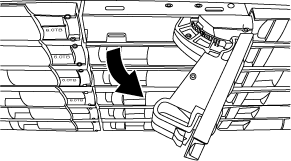

= Troque a quente uma unidade de disco em um compartimento de disco de DS224C TB ou DS212C TB - compartimentos com módulos de IOM12 TB/IOM12B TB
:allow-uri-read: 
:icons: font
:imagesdir: ../media/

[role="lead"]
Você pode trocar a quente uma unidade de disco com falha em um compartimento de disco de DS224C GB ou DS212C GB.

.Antes de começar
* A unidade de disco que você está instalando deve ser suportada pelo compartimento de disco DS224C ou DS212C.
+
https://hwu.netapp.com["NetApp Hardware Universe"^]

* Todos os outros componentes do sistema devem estar funcionando corretamente; caso contrário, entre em Contato com o suporte técnico.
* A unidade de disco que está a remover tem de estar avariada.
+
Você pode verificar se a unidade de disco está com falha executando o `storage disk show -broken` comando. A unidade de disco com falha aparece na lista de unidades de disco com falha. Se isso não acontecer, você deve esperar, e executar o comando novamente.

+

NOTE: Dependendo do tipo e da capacidade da unidade de disco, pode levar até várias horas para que a unidade de disco apareça na lista de unidades de disco com falha.

* Se você estiver substituindo um disco de criptografia automática (SED), siga as instruções para substituir um SED na documentação do ONTAP para sua versão do ONTAP.
+
As instruções na documentação do ONTAP descrevem as etapas adicionais que você deve executar antes e depois de substituir uma SED.

+
https://docs.netapp.com/us-en/ontap/encryption-at-rest/index.html["Visão geral da criptografia NetApp com a CLI"^]

.Sobre esta tarefa
* Deve tomar medidas para evitar descargas eletrostáticas (ESD):
+
** Mantenha a unidade de disco no saco ESD até que esteja pronto para instalá-la.
** Abra o saco ESD à mão ou corte a parte superior com uma tesoura.
+

NOTE: Não insira uma ferramenta de metal ou faca no saco ESD.

** Utilize sempre uma pulseira antiestática ligada à terra a uma superfície não pintada no chassis do compartimento de armazenamento.
+
Se uma pulseira não estiver disponível, toque numa superfície não pintada no chassis do compartimento de armazenamento antes de manusear a unidade de disco.

* Você deve tomar medidas para lidar com unidades de disco cuidadosamente:
+
** Sempre use duas mãos ao remover, instalar ou transportar uma unidade de disco para suportar seu peso.
+

NOTE: Não coloque as mãos nas placas de unidade de disco expostas na parte inferior do suporte de unidade de disco.

** Você deve colocar unidades de disco em superfícies almofadadas e nunca empilhar unidades de disco umas sobre as outras.
** Você deve ter cuidado para não bater unidades de disco contra outras superfícies.

* As unidades de disco devem ser mantidas longe de dispositivos magnéticos.
+

NOTE: Os campos magnéticos podem destruir todos os dados na unidade de disco e causar danos irreparáveis aos circuitos da unidade de disco.

* A prática recomendada é ter a versão atual do Pacote de Qualificação de disco (DQP) instalada antes de trocar uma unidade de disco a quente.
+
Ter a versão atual do DQP instalada permite que seu sistema reconheça e utilize unidades de disco recém-qualificadas; portanto, evitando mensagens de eventos do sistema sobre ter informações de unidades de disco não atuais. Você também evita a possível prevenção do particionamento de disco porque as unidades de disco não são reconhecidas. O DQP também notifica você sobre firmware de unidade de disco não atual.

+
https://mysupport.netapp.com/site/downloads/firmware/disk-drive-firmware/download/DISKQUAL/ALL/qual_devices.zip["NetApp Downloads: Pacote de Qualificação de disco"^]

* A prática recomendada é ter as versões atuais do firmware da gaveta de disco (IOM) e das unidades de disco em seu sistema antes de adicionar novas gavetas de disco, componentes de FRU de gaveta ou cabos SAS.
+
As versões atuais do firmware podem ser encontradas no site de suporte da NetApp.

+
https://mysupport.netapp.com/site/downloads/firmware/disk-shelf-firmware["Downloads do NetApp: Firmware da gaveta de disco"^]

+
https://mysupport.netapp.com/site/downloads/firmware/disk-drive-firmware["Downloads do NetApp: Firmware da unidade de disco"^]

* O firmware da unidade de disco é atualizado automaticamente (sem interrupções) em novas unidades de disco com versões de firmware não atuais.
+

NOTE: As verificações de firmware da unidade de disco ocorrem a cada dois minutos.

* Se necessário, você pode ligar os LEDs de localização (azul) do compartimento de disco para ajudar a localizar fisicamente o compartimento de disco afetado: `storage shelf location-led modify -shelf-name _shelf_name_ -led-status on`
+
Uma gaveta de disco tem três LEDs de localização: Um no painel de exibição do operador e um em cada gaveta IOM. Os LEDs de localização permanecem acesos durante 30 minutos. Você pode desativá-los digitando o mesmo comando, mas usando a opção Off.

* Se necessário, você pode consultar a seção LEDs do compartimento de disco de monitoramento para obter informações sobre o significado e a localização dos LEDs do compartimento de disco no painel de exibição do operador e nos componentes FRU.

.Passos
. Se você quiser atribuir manualmente a propriedade do disco para a unidade de disco de substituição, será necessário desativar a atribuição automática de unidade se ela estiver ativada; caso contrário, vá para a próxima etapa.
+

NOTE: Você precisa atribuir manualmente a propriedade de disco se as unidades de disco na stack forem de propriedade de ambas as controladoras de um par de HA.

+

NOTE: Atribua manualmente a propriedade do disco e, em seguida, reative a atribuição automática de unidade mais adiante neste procedimento.

+
.. Verifique se a atribuição automática de unidades está ativada:``storage disk option show``
+
Se você tiver um par de HA, poderá inserir o comando no console de qualquer controlador.

+
Se a atribuição automática de unidade estiver ativada, a saída mostrará "'on'" (para cada controlador) na coluna "'Auto Assign'".

.. Se a atribuição automática de unidades estiver ativada, é necessário desativá-la:``storage disk option modify -node _node_name_ -autoassign off``
+
Você precisa desativar a atribuição automática de unidades em ambos os controladores em um par de HA.

. Aterre-se corretamente.
. Desembale a nova unidade de disco e coloque-a numa superfície nivelada perto da prateleira de disco.
+
Salve todos os materiais de embalagem para uso ao retornar a unidade de disco com falha.

+

NOTE: O NetApp requer que todas as unidades de disco retornadas estejam em um saco com classificação ESD.

. Identifique fisicamente a unidade de disco com falha a partir da mensagem de aviso do console do sistema e do LED de atenção (âmbar) iluminado na unidade de disco.
+

NOTE: O LED de atividade (verde) em uma unidade de disco com falha pode ser iluminado (sólido), o que indica que a unidade de disco tem energia, mas não deve estar piscando, o que indica atividade de e/S. Uma unidade de disco com falha não tem atividade de e/S.

. Pressione o botão de liberação na face da unidade de disco e, em seguida, puxe a alça do came para a posição totalmente aberta para liberar a unidade de disco do plano médio.
+
Quando prime o botão de libertação, a pega do excêntrico nas molas da unidade de disco abre parcialmente.

+

NOTE: As unidades de disco em um compartimento de disco DS212C são dispostas horizontalmente com o botão de liberação localizado à esquerda da face da unidade de disco. As unidades de disco em um compartimento de disco DS224C são dispostas verticalmente com o botão de liberação localizado na parte superior da face da unidade de disco.

+
A seguir mostra as unidades de disco em um compartimento de disco de DS212C GB:

+

+
A seguir mostra as unidades de disco em um compartimento de disco de DS224C GB:

+
image::../media/2240_removing_disk_no_bezel.png[Remoção de discos no compartimento de disco DS224C]

. Deslize ligeiramente a unidade de disco para fora para permitir que o disco gire com segurança e, em seguida, remova a unidade de disco do compartimento de disco.
+
Um disco rígido pode demorar até um minuto para reduzir com segurança.

+

NOTE: Ao manusear uma unidade de disco, utilize sempre duas mãos para suportar o seu peso.

. Usando duas mãos, com a alça do came na posição aberta, insira a unidade de disco de substituição na prateleira de discos, empurrando firmemente até que a unidade de disco pare.
+

NOTE: Aguarde pelo menos 10 segundos antes de inserir uma nova unidade de disco. Isso permite que o sistema reconheça que uma unidade de disco foi removida.

+

NOTE: Não coloque as mãos nas placas de unidade de disco expostas na parte inferior do suporte de disco.

. Feche a alça do came de modo que a unidade de disco fique totalmente encaixada no plano médio e a alça encaixe no lugar.
+
Certifique-se de que fecha a pega do came lentamente de forma a que fique corretamente alinhada com a face da unidade de disco.

. Se estiver substituindo outra unidade de disco, repita as etapas 3 a 8.
. Verifique se o LED de atividade (verde) da unidade de disco está aceso.
+
Quando o LED de atividade da unidade de disco estiver verde fixo, significa que a unidade de disco tem energia. Quando o LED de atividade da unidade de disco está piscando, significa que a unidade de disco tem energia e e e/S está em andamento. Se o firmware da unidade de disco estiver sendo atualizado automaticamente, o LED estará piscando.

. Se você desativou a atribuição automática de unidade na Etapa 1, atribua manualmente a propriedade do disco e, em seguida, reative a atribuição automática de unidade, se necessário:
+
.. Exibir todos os discos não possuídos:``storage disk show -container-type unassigned``
.. Atribuir cada disco:``storage disk assign -disk _disk_name_ -owner _owner_name_``
+
Você pode usar o caractere curinga para atribuir mais de um disco de uma vez.

.. Reative a atribuição automática de condução, se necessário:``storage disk option modify -node _node_name_ -autoassign on``
+
É necessário reativar a atribuição automática de unidades em ambas as controladoras em um par de HA.

. Devolva a peça com falha ao NetApp, conforme descrito nas instruções de RMA fornecidas com o kit.
+
Entre em Contato com o suporte técnico em https://mysupport.netapp.com/site/global/dashboard["Suporte à NetApp"], 888-463-8277 (América do Norte), 00-800-44-638277 (Europa) ou 800-800-80-800 (Ásia/Pacífico) se precisar do número de RMA ou de ajuda adicional com o procedimento de substituição.

