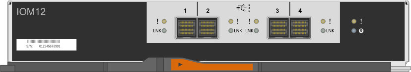
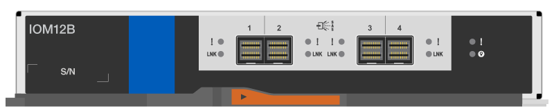

= Troque a quente ou substitua um módulo IOM DS212C, DS224C ou DS460C
:allow-uri-read: 
:icons: font
:imagesdir: ../media/

[role="lead"]
A configuração do seu sistema determina se você pode realizar uma troca a quente não disruptiva do shelf IOM ou uma substituição disruptiva do shelf IOM quando um shelf IOM12, IOM12B ou IOM12C falhar.

.Sobre esta tarefa
* Este procedimento aplica-se a shelves com módulos IOM12, IOM12B ou IOM12C.
+

NOTE: Este procedimento destina-se à troca ou substituição a quente de módulos IOM idênticos já existentes. Isso significa que você só pode substituir um módulo IOM12 por outro módulo IOM12, um módulo IOM12B por outro módulo IOM12B ou um módulo IOM12C por outro módulo IOM12C.

* Os módulos IOM12, IOM12B ou IOM12C podem ser distinguidos pela sua aparência:
+
Os IOM12 módulos distinguem-se por uma etiqueta "IOM12":

+

+
Os IOM12B módulos distinguem-se por uma faixa azul e uma etiqueta "IOM12B":

+

+
Os módulos IOM12C distinguem-se por uma faixa azul e cinza e uma etiqueta com a inscrição "IOM12C":

+
image::../media/drw_iom12c_ieops-2175.svg[Frente do IOM12C]

* Para configurações com vários caminhos (HA ou multipath), HA de três caminhos e caminhos quádruplos (HA de quatro caminhos ou quatro caminhos), você pode trocar a quente uma IOM de gaveta (substituir sem interrupções uma IOM de gaveta em um sistema que está ligado e fornecendo dados - e/S em andamento).
* Para configurações de par de HA de caminho único da série FAS2700, você deve executar uma operação de takeover e giveback para substituir um IOM de shelf em um sistema que está ligado e fornecendo dados, com E/S em andamento.
+

CAUTION: Se você tentar trocar uma gaveta IOM em um compartimento de disco por uma conexão de caminho único, perderá todo o acesso às unidades de disco na gaveta de disco, bem como às gavetas de disco abaixo. Você também pode derrubar todo o seu sistema.

* O firmware da gaveta de disco (IOM) é atualizado automaticamente (sem interrupções) em uma nova IOM de gaveta com uma versão de firmware não atual.
+
As verificações de firmware da OIM da gaveta ocorrem a cada dez minutos. Uma atualização de firmware IOM pode levar até 30 minutos.

* Se necessário, você pode ligar os LEDs de localização (azul) do compartimento de disco para ajudar a localizar fisicamente o compartimento de disco afetado: `storage shelf location-led modify -shelf-name _shelf_name_ -led-status on`
+
Uma gaveta de disco tem três LEDs de localização: Um no painel de exibição do operador e um em cada gaveta IOM. Os LEDs de localização permanecem acesos durante 30 minutos. Você pode desativá-los digitando o mesmo comando, mas usando a opção Off.

* Caso necessário, você pode consultar o link:service-monitor-leds.html#operator-display-panel-leds["Monitoramento de LEDs da prateleira de disco"]guia para obter informações sobre o significado e a localização dos LEDs do compartimento de discos no painel de exibição do operador e dos componentes FRU.

.Antes de começar
* Todos os outros componentes do sistema, incluindo o outro módulo IOM12, IOM12B ou IOM12C, devem estar funcionando corretamente.
* *Prática recomendada*: Certifique-se de que seu sistema tenha as versões atuais do firmware da prateleira de disco (IOM) e do firmware da unidade de disco antes de adicionar novas prateleiras de disco, componentes de FRU de prateleira ou cabos SAS. Você pode visitar o site de suporte da NetApp para  https://mysupport.netapp.com/site/downloads/firmware/disk-shelf-firmware["baixar firmware da prateleira de disco"] e  https://mysupport.netapp.com/site/downloads/firmware/disk-drive-firmware["baixar firmware da unidade de disco"] .

.Passos
. Aterre-se corretamente.
. Desembale a nova gaveta IOM e coloque-a em uma superfície nivelada perto da gaveta de disco.
+
Guarde todos os materiais de embalagem para utilização ao devolver a IOM da prateleira com falha.

. Identifique fisicamente a IOM da gaveta com falha a partir da mensagem de aviso do console do sistema e do LED de atenção iluminada (âmbar) na IOM da gaveta com falha.
. Execute uma das seguintes ações com base no tipo de configuração que você tem:
+
[cols="2*"]
|===
| Se você tem um... | Então... 

 a| 
Multipath HA, tri-path HA, multipath, quad-path HA ou configuração quad-path
 a| 
Vá para a próxima etapa.

 a| 
Configuração de HA de caminho único da série FAS2700
 a| 
.. Determine o nó de destino (o nó ao qual a IOM da gaveta com falha pertence).
+
Iom A pertence ao controlador 1. IOM B pertence ao controlador 2.

.. Assuma o nó de destino: `storage failover takeover -bynode _partner HA node_`

|===
. Desconete o cabeamento da gaveta IOM que você está removendo.
+
Anote as portas IOM da gaveta às quais cada cabo está conetado.

. Pressione a trava laranja na alça da came IOM da prateleira até que ela se solte e, em seguida, abra a alça da came totalmente para liberar a IOM da prateleira do plano médio.
+
image::../media/drw_iom_latch.png[Solte o trinco da alavanca do came]

+
image::../media/drw_iom_open.png[Alavanca do came na posição aberta]

. Use a alça do came para deslizar a gaveta IOM para fora da gaveta de disco.
+
Ao manusear uma prateleira IOM, utilize sempre as duas mãos para suportar o seu peso.

. Aguarde pelo menos 70 segundos após a remoção da gaveta IOM antes de instalar a nova IOM de gaveta.
+
Aguardar pelo menos 70 segundos permite ao condutor registar corretamente a ID da prateleira.

. Usando duas mãos, com a alça da came da nova IOM da gaveta na posição aberta, apoie e alinhe as bordas da nova IOM da gaveta com a abertura na gaveta de disco e, em seguida, empurre firmemente a nova IOM da gaveta até que ela atenda ao plano médio.
+

NOTE: Não use força excessiva ao deslizar a gaveta IOM para dentro da gaveta de disco; você pode danificar os conetores.

. Feche a pega do excêntrico de forma a que o trinco encaixe na posição de bloqueio e a prateleira IOM fique totalmente assente.
. Reconecte o cabeamento.
+
Os conetores de cabo SAS são chaveados; quando orientados corretamente para uma porta IOM, o conetor clica no lugar e o LED LNK da porta IOM acende-se a verde. Você insere um conetor de cabo SAS em uma porta IOM com a aba de puxar orientada para baixo (na parte inferior do conetor).

. Execute uma das seguintes ações com base no tipo de configuração que você tem:
+
[cols="2*"]
|===
| Se você tem um... | Então... 

 a| 
Multipath HA, tri-path HA, multipath, quad-path HA ou configuração quad-path
 a| 
Vá para a próxima etapa.

 a| 
Configuração de HA de caminho único da série FAS2700
 a| 
Devolver o nó de destino: `storage failover giveback -fromnode partner_HA_node`

|===
. Verifique se os links da porta IOM da gaveta foram estabelecidos.
+
Para cada porta de módulo que você cabeou, o LED LNK (verde) acende quando uma ou mais das quatro faixas SAS estabeleceram um link (com um adaptador ou outro compartimento de disco).

. Devolva a peça com falha ao NetApp, conforme descrito nas instruções de RMA fornecidas com o kit.
+
Entre em Contato com o suporte técnico em https://mysupport.netapp.com/site/global/dashboard["Suporte à NetApp"], 888-463-8277 (América do Norte), 00-800-44-638277 (Europa) ou 800-800-80-800 (Ásia/Pacífico) se precisar do número de RMA ou de ajuda adicional com o procedimento de substituição.

