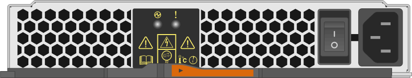
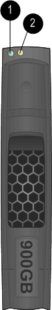

= Monitorar LEDs do compartimento de disco - prateleiras com módulos IOM12/IOM12B
:allow-uri-read: 
:icons: font
:imagesdir: ../media/

[role="lead"]
Você pode monitorar a integridade do compartimento de disco compreendendo a localização e as condições de status dos LEDs nos componentes do compartimento de disco.

== LEDs do painel de visualização do operador

Os LEDs no painel de exibição frontal do operador da prateleira de discos indicam se o compartimento de disco está funcionando normalmente ou se há problemas com o hardware.

A tabela a seguir descreve os três LEDs no painel de exibição do operador usados nas prateleiras de discos DS460C, DS224C e DS212C:

[cols="4*"]
|===
| Ícone LED | Nome do LED | Estado | Descrição 

 a| 
image::../media/drw_sas_power_icon.svg[Ícone de alimentação]
 a| 
Potência
 a| 
Verde sólido
 a| 
Uma ou mais fontes de alimentação estão fornecendo energia para o compartimento de disco.

.2+| image:../media/drw_sas_fault_icon.svg["Ícone de atenção, largura: 5px mm"] .2+| Atenção  a| 
Âmbar sólido
 a| 
Ocorreu um erro com a função de uma de mais FRUs: O compartimento de disco, as unidades de disco, os módulos IOM12/IOM12B ou as fontes de alimentação.

Verifique as mensagens de eventos para determinar as ações corretivas a serem tomadas.

 a| 
Âmbar intermitente
 a| 
O ID do compartimento está em um estado pendente.

Ligue o compartimento de disco para que o ID do compartimento tenha efeito.

 a| 
image::../media/drw_sas3_location_icon.svg[Ícone de localização]
 a| 
Localização
 a| 
Azul sólido
 a| 
O administrador do sistema ativou esta função LED para ajudar a localizar fisicamente o compartimento de disco que requer manutenção.

O LED de localização no painel de visualização do operador e ambos os módulos IOM12/IOM12B acendem-se quando esta função LED é ativada. Os LEDs de localização desligam-se automaticamente após 30 minutos.

|===
Dependendo do modelo do compartimento de disco, o painel de exibição do operador parece diferente; no entanto, os três LEDs estão dispostos da mesma maneira.

A ilustração a seguir é de um painel de exibição do operador da prateleira de discos de DS224C mm com a tampa final ligada:

image::../media/drw_opd.gif[Visor do operador da tampa final]

== LEDs do módulo IOM12/IOM12B

Os LEDs no módulo IOM12/IOM12B indicam se o módulo está funcionando normalmente, se ele está pronto para tráfego de e/S e se há algum problema com o hardware.

A tabela a seguir descreve os LEDs do módulo IOM12/IOM12B associados à função do módulo e à função de cada porta SAS no módulo.

O módulo IOM12/IOM12B é usado nas gavetas de disco DS460C, DS224C e DS212C.

[cols="4*"]
|===
| Ícone LED | Nome do LED | Estado | Descrição 

 a| 
image::../media/drw_sas_fault_icon.svg[Ícone de atenção]
 a| 
Atenção
 a| 
Âmbar sólido
 a| 
Função do módulo IOM12/IOM12B: Ocorreu um erro com a função do módulo IOM12/IOM12B.

Função de porta SAS: Menos do que todas as quatro faixas SAS estabeleceram um link (com um adaptador ou outro compartimento de disco).

Verifique as mensagens de eventos para determinar as ações corretivas a serem tomadas.

 a| 
LNK
 a| 
Ligação da porta
 a| 
Verde sólido
 a| 
Uma ou mais das quatro faixas SAS estabeleceu um link (com um adaptador ou outro compartimento de disco).

 a| 
image::../media/drw_sas3_location_icon.svg[Ícone de localização]
 a| 
Localização
 a| 
Azul sólido
 a| 
O administrador do sistema ativou esta função LED para ajudar a localizar fisicamente o compartimento de disco com o módulo IOM12/IOM12B com falha.

O LED de localização no painel de visualização do operador e ambos os módulos IOM12/IOM12B acendem-se quando esta função LED é ativada. Os LEDs de localização desligam-se automaticamente após 30 minutos.

|===
A ilustração a seguir é para um módulo IOM12:

image::../media/drw_iom12.gif[Módulo IOM12]

Os IOM12B módulos distinguem-se por uma faixa azul e uma etiqueta "IOM12B":

image::../media/iom12b.png[Módulo IOM12B]

== LEDs da fonte de alimentação

Os LEDs na fonte de alimentação indicam se a fonte de alimentação está funcionando normalmente ou se há problemas de hardware.

A tabela a seguir descreve os dois LEDs nas fontes de alimentação usadas nos compartimentos de disco DS460C, DS224C e DS212C:

[cols="4*"]
|===
| Ícone LED | Nome do LED | Estado | Descrição 

.2+| image:../media/drw_sas_power_icon.svg["Ícone de alimentação, largura de 20px mm"] .2+| Potência  a| 
Verde sólido
 a| 
A fonte de alimentação está a funcionar corretamente.

 a| 
Desligado
 a| 
A fonte de alimentação falhou, o interrutor CA está desligado, o cabo de alimentação CA não está corretamente instalado ou a eletricidade não está sendo fornecida corretamente à fonte de alimentação.

Verifique as mensagens de eventos para determinar as ações corretivas a serem tomadas.

 a| 
image::../media/drw_sas_fault_icon.svg[Ícone de atenção]
 a| 
Atenção
 a| 
Âmbar sólido
 a| 
Ocorreu um erro com a função da fonte de alimentação.

Verifique as mensagens de eventos para determinar as ações corretivas a serem tomadas.

|===
Dependendo do modelo do compartimento de disco, as fontes de alimentação podem ser diferentes, ditando a localização dos dois LEDs.

A ilustração a seguir refere-se a uma fonte de alimentação usada em um compartimento de disco de DS460C GB.

Os dois ícones de LED funcionam como etiquetas e LEDs, o que significa que os próprios ícones acendem - não há LEDs adjacentes.

image::../media/28_dwg_e2860_de460c_psu.gif[LEDs da fonte de alimentação]

A ilustração a seguir refere-se a uma fonte de alimentação usada em um compartimento de disco de DS224C GB ou DS212C GB:

== LEDs do ventilador em DS460C prateleiras de disco

Os LEDs nos ventiladores DS460C indicam se o ventilador está funcionando normalmente ou se há problemas de hardware.

A tabela a seguir descreve os LEDs nos ventiladores usados em DS460C compartimentos de disco:

[cols="4*"]
|===
| Item | Nome do LED | Estado | Descrição 

 a| 
image:../media/icon_round_1.png["Legenda número 1"]
 a| 
Atenção
 a| 
Âmbar sólido
 a| 
Ocorreu um erro com a função da ventoinha.

Verifique as mensagens de eventos para determinar as ações corretivas a serem tomadas.

|===
image::../media/28_dwg_e2860_de460c_single_fan_canister_with_led_callout.gif[LED de atenção da ventoinha]

== LEDs da unidade de disco

Os LEDs em uma unidade de disco indicam se ela está funcionando normalmente ou se há problemas com o hardware.

=== LEDs da unidade de disco para compartimentos de disco DS224C e DS212C

A tabela a seguir descreve os dois LEDs nas unidades de disco usadas nos compartimentos de disco DS224C e DS212C:

[cols="4*"]
|===
| Legenda | Nome do LED | Estado | Descrição 

.2+| image:../media/icon_round_1.png["Legenda número 1"] .2+| Atividade  a| 
Verde sólido
 a| 
A unidade de disco tem energia.

 a| 
Verde intermitente
 a| 
A unidade de disco tem energia e as operações de e/S estão em andamento.

 a| 
image:../media/icon_round_2.png["Legenda número 2"]
 a| 
Atenção
 a| 
Âmbar sólido
 a| 
Ocorreu um erro com a função da unidade de disco.

Verifique as mensagens de eventos para determinar as ações corretivas a serem tomadas.

|===
Dependendo do modelo do compartimento de disco, as unidades de disco são dispostas verticalmente ou horizontalmente no compartimento de disco, ditando a localização dos dois LEDs.

A ilustração a seguir é para uma unidade de disco usada em um compartimento de disco de DS224C GB.

Os compartimentos de disco DS224C usam unidades de disco de 2,5 polegadas dispostas verticalmente no compartimento de disco.

A ilustração a seguir é para uma unidade de disco usada em um compartimento de disco de DS212C GB.

Os compartimentos de disco DS212C usam unidades de disco de 3,5 polegadas ou unidades de disco de 2,5 polegadas em suportes dispostos horizontalmente no compartimento de disco.

image::../media/drw_diskdrive_ds212c.gif[LEDs do suporte da unidade horizontal]

=== LEDs da unidade de disco para DS460C compartimentos de disco

A ilustração e a tabela a seguir descrevem os LEDs de atividade da unidade na gaveta da unidade e seus estados operacionais:

image::../media/2860_dwg_drive_drawer_leds.gif[LEDs de atividade da unidade]

[cols="4*"]
|===
| Localização | LED | Indicador de estado | Descrição 

.3+| 1 .3+| Atenção: Atenção da gaveta para cada gaveta  a| 
Âmbar sólido
 a| 
Um componente dentro da gaveta da unidade requer a atenção do operador.

 a| 
Desligado
 a| 
Nenhuma unidade ou outro componente na gaveta requer atenção e nenhuma unidade na gaveta tem uma operação de localização ativa.

 a| 
Âmbar intermitente
 a| 
Uma operação de localizar unidade está ativa para qualquer unidade dentro da gaveta.

.3+| 2-13 .3+| Atividade: Atividade da unidade para unidades de 0 a 11 na gaveta da unidade  a| 
Verde
 a| 
A alimentação é ligada e a unidade está a funcionar normalmente.

 a| 
Verde intermitente
 a| 
A unidade tem energia e as operações de e/S estão em andamento.

 a| 
Desligado
 a| 
A alimentação é desligada.

|===
Quando a gaveta da unidade está aberta, um LED de atenção pode ser visto na frente de cada unidade.

image::../media/2860_dwg_amber_on_drive.gif[LED de atenção da unidade]

[cols="10,90"]
|===

 a| 
image:../media/icon_round_1.png["Legenda número 1"]
| Luz LED atenção acesa 
|===