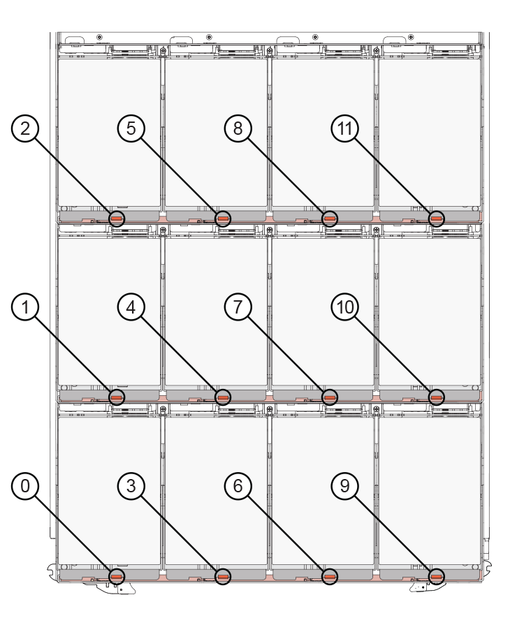

= Substitua uma gaveta de unidades em um compartimento de disco DS460C - gavetas com módulos IOM12/IOM12B
:allow-uri-read: 
:icons: font
:imagesdir: ../media/

[role="lead"]
Substituir um gaveta de unidade em uma gaveta requer que você interrompa todo o sistema de storage (par de HA), o que permite manter os agregados de dados na gaveta ou que você tenha a opção de manter o par de HA em funcionamento, o que requer que você mova todos os dados dos agregados de dados nas unidades de disco e offline e exclua os agregados de dados. No entanto, se o compartimento contiver um agregado de raiz, será necessário interromper o par de HA.

.Antes de começar
Você precisa destes itens para este procedimento:

* Proteção antiestática
+

NOTE: *Possíveis danos ao hardware:* para evitar danos de descarga eletrostática na prateleira de acionamento, use proteção antiestática adequada ao manusear componentes da prateleira de acionamento.

* Gaveta da unidade de substituição
* Substituição das correntes dos cabos esquerda e direita
* Lanterna

.Sobre esta tarefa
* Este procedimento se aplica a prateleiras com gavetas de unidade DCM e/ou gavetas de unidade DCM2. (As prateleiras também terão dois módulos IOM12 ou dois módulos IOM12B.)
+
Quando uma gaveta de unidade DCM ou DCM2 falha, você recebe uma gaveta de unidade DCM ou DCM2 para substituí-la.

[NOTE]
====
Se, ao substituir uma gaveta de unidade com falha, ela resultar na combinação de IOM12 módulos e qualquer número de DCM2 gavetas de unidade, você deve atualizar o IOM12 FW para a versão 0300 ou posterior porque os módulos IOM12 exigem uma versão do FW que suporta DCM2 gavetas de unidade.

A atualização IOM12 FW pode ser feita antes ou depois de substituir uma gaveta de unidade. Este procedimento permite atualizar o FW como parte do procedimento de preparação para a substituição da gaveta.

====
* As gavetas de acionamento DCM e as DCM2 gavetas de acionamento podem ser distinguidas pela sua aparência:
+
As gavetas da unidade DCM têm a seguinte aparência:

+
image::../media/28_dwg_e2860_de460c_front_no_callouts.gif[Vista dianteira de um compartimento de unidade DCM]

+
As DCM2 gavetas de acionamento distinguem-se por uma faixa azul e etiqueta "DCM2":

+
image::../media/dcm2.png[Vista dianteira do compartimento de unidades de DCM2 U.]

== Prepare-se para substituir uma gaveta de unidade

Antes de substituir um gaveta de unidade, você deve atualizar o IOM12 FW, se necessário, e interromper o par de HA, que permite manter os agregados de dados na gaveta, ou você tem a opção de manter o par de HA ativo e em execução, o que exige que você mova todos os dados dos agregados de dados que residem nas unidades de disco e off-line e excluir os agregados de dados. No entanto, se o compartimento contiver um agregado de raiz, será necessário interromper o par de HA. Por último, você deve desligar a prateleira.

.passos
. Determine se quando você substitui a gaveta de unidade com falha, isso resulta em que a gaveta tenha uma combinação de IOM12 módulos e qualquer número de gavetas de unidade DCM2.
. Se a prateleira tiver uma combinação de IOM12 módulos e qualquer número de DCM2 gavetas de unidade, você deve atualizar o IOM12 FW para a versão 0300 ou posterior; caso contrário, vá para a próxima etapa.
+
As versões atuais do firmware podem ser encontradas no site de suporte da NetApp.

+
https://mysupport.netapp.com/site/downloads/firmware/disk-shelf-firmware["Downloads do NetApp: Firmware da gaveta de disco"]

. Se o compartimento contiver o agregado raiz de qualquer controlador no par de HA ou se você optar por interromper o par de HA (em vez de manter o par de HA ativo e em execução), execute as seguintes etapas; caso contrário, vá para a próxima etapa.
+

NOTE: Agregados de dados podem permanecer na gaveta ao parar o par de HA.

+
.. Parar ambas as controladoras no par de HA.
.. Verifique se o par de HA foi interrompido verificando o console do sistema de storage.
.. Desligue a prateleira.
.. Vá para a secção, <<Retire as correntes dos cabos>>.

. Se você optar por manter o par de HA ativo e em execução, execute as seguintes etapas:
+

NOTE: Se você tentar substituir uma gaveta por agregados no compartimento de disco, poderá causar uma interrupção do sistema com um pânico multidisco.

+
.. Mover todos os dados dos agregados de dados que residem nas unidades de disco.
+
Os dados incluem, entre outros, volumes e LUNs.

.. Offine e exclua os agregados para permitir que as unidades de disco se tornem sobressalentes:
+
Os comandos podem ser inseridos a partir do clustershell de qualquer controlador.

+
`storage aggregate offline -aggregate _aggregate_name_`

+
`storage aggregate delete -aggregate _aggregate_name_`

.. Verifique se as unidades de disco não têm agregados (são sobressalentes):
+
... Digite o seguinte comando a partir do clustershell de qualquer controlador: `storage disk show -shelf _shelf_number_`
... Verifique a saída para verificar se as unidades de risco são sobressalentes.
+
As unidades de disco que são sobressalentes são exibidas `spare` `Container Type` na coluna.

+

NOTE: Se você tiver unidades de disco com falha no compartimento, `broken` será exibido na `Container Type` coluna .

.. Desligue a prateleira.

== Retire as correntes dos cabos

As correntes de cabo esquerda e direita para cada gaveta de unidade na prateleira de unidade DS460C permitem que as gavetas deslizem para dentro e para fora. Antes de remover uma gaveta de unidade, você deve remover ambas as correntes de cabo.

.Antes de começar
* Você concluiu as <<Prepare-se para substituir uma gaveta de unidade>> etapas para que seu par de HA seja interrompido ou mova todos os dados dos agregados de dados que residem nas unidades de disco e desalinhou e excluiu os agregados de dados para permitir que as unidades de disco se tornem sobressalentes.
* Você desligou a prateleira.
* Você obteve os seguintes itens:
+
** Proteção antiestática
+

NOTE: *Possíveis danos ao hardware:* para evitar danos por descarga eletrostática na prateleira, use proteção antiestática adequada ao manusear componentes da prateleira.

** Lanterna

.Sobre esta tarefa
Cada gaveta de unidade tem correntes de cabo esquerda e direita. As extremidades metálicas nas correntes de cabos deslizam para os suportes verticais e horizontais correspondentes dentro do compartimento, da seguinte forma:

* Os suportes verticais esquerdo e direito conetam a corrente do cabo ao plano médio do gabinete.
* Os suportes horizontais esquerdo e direito ligam a corrente do cabo à gaveta individual.

.Passos
. Coloque proteção antiestática.
. A partir da parte traseira da prateleira de acionamento, retire o módulo da ventoinha do lado direito, da seguinte forma:
+
.. Prima a patilha cor-de-laranja para soltar o manípulo do módulo da ventoinha.
+
A figura mostra a pega do módulo da ventoinha estendida e libertada da patilha cor-de-laranja à esquerda.

+
image::../media/28_dwg_e2860_de460c_fan_canister_handle_with_callout.gif[Manípulo do módulo da ventoinha estendida]

+
[cols="10,90"]
|===

 a| 
image:../media/icon_round_1.png["Legenda número 1"]
| Manípulo do módulo da ventoinha 
|===
.. Utilizando a pega, puxe o módulo do ventilador para fora da prateleira de acionamento e coloque-o de lado.

. Determine manualmente qual das cinco correntes de cabos a desligar.
+
A figura mostra o lado direito da prateleira de acionamento com o módulo do ventilador removido. Com o módulo do ventilador removido, você pode ver as cinco correntes de cabo e os conetores verticais e horizontais para cada gaveta. As legendas para a gaveta de unidades 1 são fornecidas.

+
image::../media/2860_dwg_full_back_view_chain_connectors.gif[Vista das cinco correntes de cabos e dos conetores verticais e horizontais para cada gaveta]

+
[cols="10,90"]
|===

 a| 
image:../media/icon_round_1.png["Legenda número 1"]
| Corrente do cabo 

 a| 
image:../media/icon_round_2.png["Legenda número 2"]
 a| 
Conetor vertical (ligado ao plano médio)

 a| 
image:../media/icon_round_3.png["Legenda número 3"]
 a| 
Conetor horizontal (ligado à gaveta da unidade)

|===
+
A corrente superior do cabo está fixada à gaveta de acionamento 1. A corrente do cabo inferior está fixada à gaveta da unidade 5.

. Use o dedo para mover a corrente do cabo do lado direito para a esquerda.
. Siga estes passos para desligar qualquer uma das correntes de cabo direitas do respetivo suporte vertical.
+
.. Usando uma lanterna, localize o anel laranja na extremidade da corrente do cabo que está conetada ao suporte vertical no gabinete.
+
image::../media/2860_dwg_vertical_ring_for_chain.gif[Anel laranja na extremidade da corrente do cabo]

+
[cols="10,90"]
|===

 a| 
image:../media/icon_round_1.png["Legenda número 1"]
| Anel laranja no suporte vertical 
|===
.. Desconete o conetor vertical (conetado ao plano médio) pressionando suavemente o centro do anel laranja e puxando o lado esquerdo do cabo para fora do compartimento.
.. Para desligar a corrente do cabo, puxe cuidadosamente o dedo na direção de aproximadamente 1 polegada (2,5 cm), mas deixe o conetor da corrente do cabo dentro do suporte vertical.

. Siga estes passos para desligar a outra extremidade da corrente do cabo:
+
.. Usando uma lanterna, localize o anel laranja na extremidade da corrente do cabo que está conetada ao suporte horizontal no gabinete.
+
A figura mostra o conetor horizontal do lado direito e a corrente do cabo desconetada e parcialmente puxada para fora do lado esquerdo.

+
image::../media/2860_dwg_horiz_ring_for_chain.gif[Corrente de cabos e anel laranja]

+
[cols="10,90"]
|===

 a| 
image:../media/icon_round_1.png["Legenda número 1"]
| Anel laranja no suporte horizontal 

 a| 
image:../media/icon_round_2.png["Legenda número 2"]
 a| 
Corrente do cabo

|===
.. Introduza cuidadosamente o dedo no anel laranja.
+
A figura mostra o anel laranja no suporte horizontal que está sendo empurrado para baixo para que o resto da corrente de cabo possa ser puxado para fora do gabinete.

.. Puxe o dedo na sua direção para desligar a corrente do cabo.

. Puxe cuidadosamente toda a corrente do cabo para fora da prateleira de acionamento.
. Na parte de trás da prateleira de acionamento, retire o módulo do ventilador esquerdo.
. Siga estes passos para desligar a corrente do cabo esquerdo do respetivo suporte vertical:
+
.. Utilizando uma lanterna, localize o anel laranja na extremidade da corrente do cabo fixada ao suporte vertical.
.. Insira o dedo no anel laranja.
.. Para desligar a corrente do cabo, puxe o dedo na direção de aproximadamente 1 polegada (2,5 cm), mas deixe o conetor da corrente do cabo dentro do suporte vertical.

. Desligue a corrente do cabo esquerdo do suporte horizontal e puxe toda a corrente do cabo para fora da prateleira de acionamento.

== Remova uma gaveta de unidades

Depois de remover as correntes de cabos direita e esquerda, você pode remover a gaveta da unidade da prateleira da unidade. Remover uma gaveta de unidade implica deslizar a parte da gaveta da saída, remover as unidades e remover a gaveta da unidade.

.Antes de começar
* Removeu as correntes de cabos direita e esquerda para a gaveta da unidade.
* Substituiu os módulos do ventilador direito e esquerdo.

.Passos
. Remova a moldura da parte frontal do compartimento de unidades.
. Desengate a gaveta da unidade puxando para fora em ambas as alavancas.
. Utilizando as alavancas estendidas, puxe cuidadosamente a gaveta da unidade para fora até parar. Não remova completamente a gaveta da unidade da prateleira da unidade.
. Remova as unidades da gaveta da unidade:
+
.. Puxe cuidadosamente para trás o trinco de libertação cor-de-laranja que está visível na parte central dianteira de cada unidade. A imagem a seguir mostra o trinco de liberação laranja para cada uma das unidades.
+

.. Levante a alavanca de acionamento para a vertical.
.. Utilize a pega para levantar a unidade da gaveta da unidade.
+
image::../media/92_dwg_de6600_install_or_remove_drive.gif[Instalar ou remover uma unidade]

.. Coloque a unidade numa superfície plana e livre de estática e afastada de dispositivos magnéticos.
+

NOTE: *Possível perda de acesso aos dados:* os campos magnéticos podem destruir todos os dados da unidade e causar danos irreparáveis aos circuitos da unidade. Para evitar a perda de acesso aos dados e danos às unidades, mantenha sempre as unidades afastadas de dispositivos magnéticos.

. Siga estes passos para remover a gaveta da unidade:
+
.. Localize a alavanca de liberação de plástico em cada lado da gaveta da unidade.
+
image::../media/92_pht_de6600_drive_drawer_release_lever.gif[Alavanca de libertação da gaveta]

+
[cols="10,90"]
|===

 a| 
image:../media/icon_round_1.png["Legenda número 1"]
| Alavanca de libertação da gaveta da unidade 
|===
.. Abra ambas as alavancas de libertação puxando os trincos na sua direção.
.. Enquanto segura ambas as alavancas de libertação, puxe a gaveta da unidade na sua direção.
.. Remova a gaveta da unidade da gaveta.

== Instale uma gaveta de unidades

Instalar uma gaveta de unidade em uma prateleira de unidade implica deslizar a gaveta para dentro do slot vazio, instalar as unidades e substituir a moldura frontal.

.Antes de começar
* Você obteve os seguintes itens:
+
** Gaveta da unidade de substituição
** Lanterna

.Passos
. A partir da parte frontal da prateleira da unidade, coloque uma lanterna na ranhura da gaveta vazia e localize a patilha de bloqueio para essa ranhura.
+
O conjunto de patilha de bloqueio é um recurso de segurança que impede que você seja capaz de abrir mais de uma gaveta de unidade de cada vez.

+
image::../media/92_pht_de6600_lock_out_tumbler_detail.gif[Localização da patilha de bloqueio e da guia da gaveta]

+
[cols="10,90"]
|===

 a| 
image:../media/icon_round_1.png["Legenda número 1"]
| Patilha de bloqueio 

 a| 
image:../media/icon_round_2.png["Legenda número 2"]
 a| 
Guia da gaveta

|===
. Posicione a gaveta da unidade de substituição na frente da ranhura vazia e ligeiramente à direita do centro.
+
Posicionar ligeiramente a gaveta à direita do centro ajuda a garantir que a patilha de bloqueio e a guia da gaveta estão corretamente engatadas.

. Deslize a gaveta da unidade para dentro da ranhura e certifique-se de que a guia da gaveta desliza por baixo da patilha de bloqueio.
+

NOTE: *Risco de danos no equipamento:* o dano ocorre se a guia da gaveta não deslizar por baixo da patilha de bloqueio.

. Empurre cuidadosamente a gaveta da unidade até que o trinco encaixe completamente.
+

NOTE: *Risco de danos no equipamento:* pare de empurrar a gaveta da unidade se sentir resistência excessiva ou emperramento. Use as alavancas de liberação na parte frontal da gaveta para deslizar a gaveta para fora. Em seguida, volte a inserir a gaveta na ranhura e certifique-se de que desliza livremente para dentro e para fora.

. Siga estas etapas para reinstalar as unidades na gaveta da unidade:
+
.. Solte a gaveta da unidade puxando para fora ambas as alavancas na parte frontal da gaveta.
.. Utilizando as alavancas estendidas, puxe cuidadosamente a gaveta da unidade para fora até parar. Não remova completamente a gaveta da unidade da prateleira da unidade.
.. Na unidade que você está instalando, levante a alça para a vertical.
.. Alinhe os dois botões levantados em cada lado da unidade com os entalhes na gaveta.
+
A figura mostra a vista do lado direito de uma unidade, mostrando a localização dos botões levantados.

+
image::../media/28_dwg_e2860_de460c_drive_cru.gif[Localização dos botões levantados na condução]

+
[cols="10,90"]
|===

 a| 
image:../media/icon_round_1.png["Legenda número 1"]
| Botão levantado no lado direito da unidade. 
|===
.. Baixe a unidade em linha reta para baixo e, em seguida, gire a alça da unidade para baixo até que ela se encaixe no lugar.
+
Se você tiver um compartimento parcialmente preenchido, o que significa que a gaveta na qual você está reinstalando unidades tem menos de 12 unidades que ele suporta, instale as primeiras quatro unidades nos slots frontais (0, 3, 6 e 9).

+

NOTE: *Risco de mau funcionamento do equipamento:* para permitir um fluxo de ar adequado e evitar o sobreaquecimento, instale sempre as quatro primeiras unidades nas ranhuras dianteiras (0, 3, 6 e 9).

+
image::../media/92_dwg_de6600_install_or_remove_drive.gif[Instalar ou remover uma unidade]

.. Repita estas subetapas para reinstalar todas as unidades.

. Deslize a gaveta de volta para a prateleira da unidade empurrando-a do centro e fechando ambas as alavancas.
+

NOTE: *Risco de mau funcionamento do equipamento:* Certifique-se de fechar completamente a gaveta da unidade empurrando ambas as alavancas. Deve fechar completamente a gaveta da unidade para permitir o fluxo de ar adequado e evitar o sobreaquecimento.

. Fixe o painel frontal à parte frontal do compartimento de unidades.

== Fixe as correntes dos cabos

A etapa final na instalação de uma gaveta de acionamento é conetar as correntes de cabo esquerda e direita de substituição à prateleira de acionamento. Ao fixar uma corrente de cabo, inverta a ordem que utilizou ao desligar a corrente de cabo. É necessário inserir o conetor horizontal da corrente no suporte horizontal do compartimento antes de inserir o conetor vertical da corrente no suporte vertical do compartimento.

.Antes de começar
* Você substituiu a gaveta da unidade e todas as unidades.
* Você tem duas correntes de cabo de substituição, marcadas como ESQUERDA e DIREITA (no conetor horizontal ao lado da gaveta da unidade).

image::../media/28_dwg_e2860_de460c_cable_chain_left.gif[Corrente do cabo de substituição do lado esquerdo]

[cols="4*"]
|===
| Legenda | Corrente do cabo | Conetor | Liga-se a. 

 a| 
image:../media/icon_round_1.png["Legenda número 1"]
| Esquerda  a| 
Vertical
 a| 
Meio plano

 a| 
image:../media/icon_round_2.png["Legenda número 2"]
 a| 
Esquerda
 a| 
Horizontal
 a| 
Gaveta da unidade

|===
image:../media/28_dwg_e2860_de460c_cable_chain_right.gif["Corrente do cabo de substituição do lado direito"]

[cols="4*"]
|===
| Legenda | Corrente do cabo | Conetor | Liga-se a. 

 a| 
image:../media/icon_round_1.png["Legenda número 1"]
| Certo  a| 
Horizontal
 a| 
Gaveta da unidade

 a| 
image:../media/icon_round_2.png["Legenda número 2"]
 a| 
Certo
 a| 
Vertical
 a| 
Meio plano

|===
.Passos
. Siga estes passos para fixar a corrente do cabo esquerdo:
+
.. Localize os conetores horizontais e verticais na corrente de cabo esquerda e os suportes horizontais e verticais correspondentes dentro do compartimento.
.. Alinhe ambos os conetores da corrente do cabo com os respetivos suportes.
.. Deslize o conetor horizontal da corrente de cabo por baixo do trilho guia no suporte horizontal e empurre-o até onde puder.
+
A figura mostra o trilho-guia no lado esquerdo da segunda gaveta da unidade no compartimento.

+
image::../media/2860_dwg_guide_rail.gif[Calha-guia]

+
[cols="10,90"]
|===

 a| 
image:../media/icon_round_1.png["Legenda número 1"]
| Calha-guia 
|===
+
[NOTE]
====
*Risco de avaria no equipamento:* Certifique-se de que faz deslizar o conetor por baixo da calha-guia no suporte. Se o conetor estiver apoiado na parte superior da calha-guia, poderão ocorrer problemas quando o sistema estiver a funcionar.

====
.. Faça deslizar o conetor vertical na corrente de cabo esquerda para o suporte vertical.
.. Depois de voltar a ligar ambas as extremidades da corrente do cabo, puxe cuidadosamente a corrente do cabo para verificar se ambos os conetores estão bloqueados.
+
[NOTE]
====
*Risco de mau funcionamento do equipamento:* se os conetores não estiverem trancados, a corrente do cabo poderá soltar-se durante o funcionamento da gaveta.

====

. Volte a instalar o módulo da ventoinha esquerda.
. Siga estes passos para voltar a fixar a corrente de cabo direita:
+
.. Localize os conetores horizontais e verticais na corrente do cabo e os respetivos suportes horizontais e verticais no interior da caixa.
.. Alinhe ambos os conetores da corrente do cabo com os respetivos suportes.
.. Faça deslizar o conetor horizontal da corrente de cabo por baixo da calha-guia no suporte horizontal e empurre-o até onde for.
+
[NOTE]
====
*Risco de avaria no equipamento:* Certifique-se de que faz deslizar o conetor por baixo da calha-guia no suporte. Se o conetor estiver apoiado na parte superior da calha-guia, poderão ocorrer problemas quando o sistema estiver a funcionar.

====
.. Deslize o conetor vertical na corrente de cabo direita para dentro do suporte vertical.
.. Depois de voltar a ligar ambas as extremidades da corrente do cabo, puxe cuidadosamente a corrente do cabo para verificar se ambos os conetores estão bloqueados.
+
[NOTE]
====
*Risco de mau funcionamento do equipamento:* se os conetores não estiverem trancados, a corrente do cabo poderá soltar-se durante o funcionamento da gaveta.

====

. Volte a instalar o módulo da ventoinha do lado direito.
. Volte a aplicar a alimentação:
+
.. Ligue ambos os interruptores de energia no compartimento de unidades.
.. Confirme que ambas as ventoinhas se acendem e que o LED âmbar na parte posterior das ventoinhas está desligado.

. Se você tiver interrompido o par de HA, inicialize o ONTAP em ambas as controladoras; caso contrário, vá para a próxima etapa.
. Se você tiver movido os dados da gaveta e excluído os agregados de dados, agora poderá usar os discos sobressalentes na gaveta para criação ou expansão de agregados.
+
https://docs.netapp.com/us-en/ontap/disks-aggregates/aggregate-creation-workflow-concept.html["Fluxo de trabalho de criação agregada"]

+
https://docs.netapp.com/us-en/ontap/disks-aggregates/aggregate-expansion-workflow-concept.html["Fluxo de trabalho de expansão agregado"]

